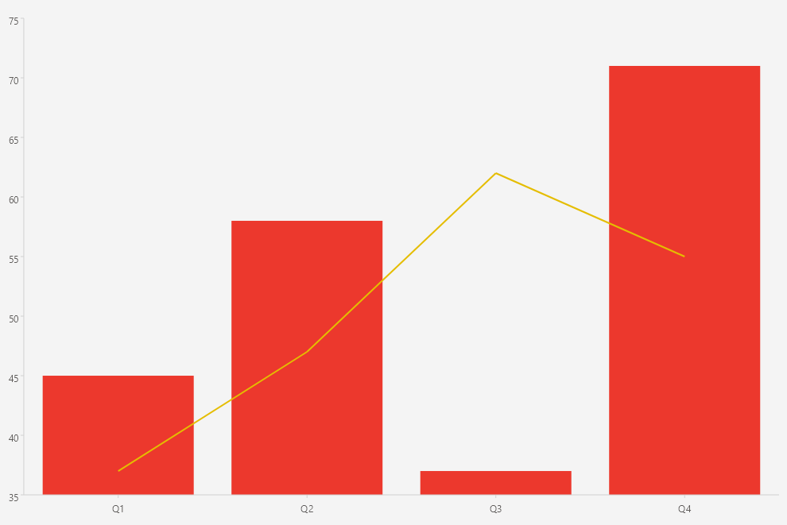
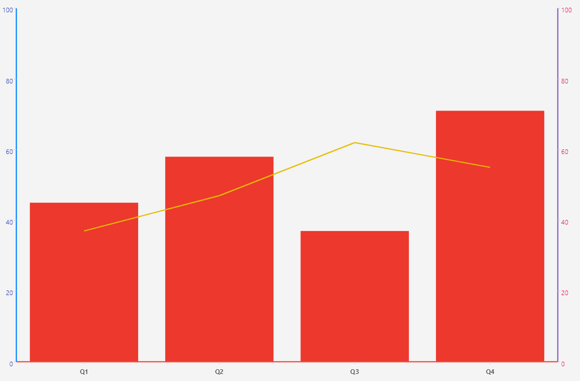

# .NET MAUI Cartesian Chart Multiple Series

The Telerik UI for .NET MAUI CartesianChart can render several series in a single chart instance. Add each series to the `Series` collection of the `RadCartesianChart`, and use the `DisplayName` property to identify each series.

## Configuration

When you combine series, keep the following in mind:

* Each series is added to the `Series` collection of the chart.
* The series share the axes defined in the `Axes` collection, unless a series specifies its own `HorizontalAxis` and `VerticalAxis`.
* Use the `DisplayName` (`string`) property of each series to distinguish it, for example in a legend.

## Example

The following example demonstrates how to combine a `BarSeries` and a `LineSeries` in a single chart.

<snippet id='chart-cartesian-multiple-series-xaml' />

2. Add the `charts` namespace:

```XAML
xmlns:charts="clr-namespace:Telerik.Maui.Controls.Charts;assembly=Telerik.Maui.Controls"
```

3. Define the data model:

<snippet id='chart-datamodel-multiseriesdata' />

4. Define the `ViewModel`:

<snippet id='chart-multiseries-viewmodel' />

This is the result:



> For a runnable example with the CartesianChart Multiple Series scenario, go to the [SDKBrowser Demo Application]() and navigate to the **Charts > Features** category.

## Explicit Axes
        
When a chart renders multiple series, you can associate each series with a specific axis through the `HorizontalAxis` and `VerticalAxis` properties of the series. This lets you plot series against different value axes in the same chart.

Here is an example of a chart with two series, each associated with its own axis:

1. Add the `RadCartesianChart` to your XAML page and configure the series with explicit axes:

<snippet id='chart-cartesian-explicit-axes-xaml' />

2. Add the `charts` namespace:

```XAML
xmlns:charts="clr-namespace:Telerik.Maui.Controls.Charts;assembly=Telerik.Maui.Controls"
```

3. Define the data model:

<snippet id='chart-datamodel-multiseriesdata' />

4. Define the `ViewModel`:

<snippet id='chart-multiseries-viewmodel' />

This is the result:



## See Also

- [Plot Areas]()
- [Palette]()
