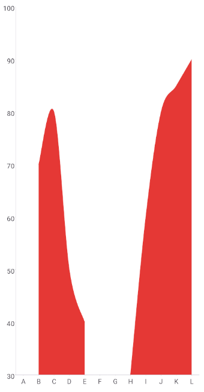

# .NET MAUI Cartesian Chart Null Values

In many scenarios some of the data points that are visualized in the Chart contain empty or null values. These are the cases when data is not available for some records from the used dataset.

The Telerik UI for .NET MAUI CartesianChart series support null values and when a data point is null, the series will skip it and continue to the next available data point. The series will not render a point for the null value, the data point will be rendered as an empty space or gap.

## Example

The following example demonstrates how to handle null values in a `SplineAreaSeries`.

1. Define the Chart with `SplineAreaSeries`:

<snippet id='chart-cartesian-null-values-xaml' />

2. Add the `charts` namespace:

```XAML
xmlns:charts="clr-namespace:Telerik.Maui.Controls.Charts;assembly=Telerik.Maui.Controls"
```

3. Define the data model and `ViewModel`:

<snippet id='chart-null-values-viewmodel' />

This is the result:



> For a runnable example with the CartesianChart null values scenario, go to the [SDKBrowser Demo Application]() and navigate to the **Charts > Features** category.

## See Also

- [Chart Plot Areas]()
- [AreaSeries]()
- [PointSeries]()
- [Categorical Axis]()