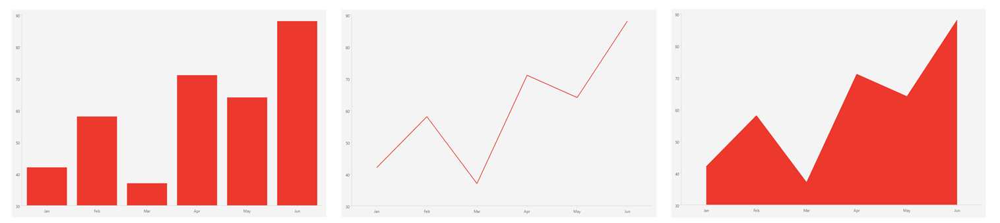

# .NET MAUI CartesianChart Overview

The Telerik UI for .NET MAUI Cartesian Chart (`RadCartesianChart`) visualizes data in a Cartesian coordinate system. The horizontal and vertical axes define how the coordinates of each data point in the plot area are calculated, and the series type defines how these data points are rendered.

## Series

The Cartesian Chart plots data through the following series:

* [`BarSeries`]()&mdash;Represents each data point as a bar.
* [`LineSeries`]()&mdash;Connects the data points with straight line segments.
* [`AreaSeries`]()&mdash;Fills the area between the line that connects the data points and the axis.
* [`PointSeries`]()&mdash;Represents each data point as a symbol positioned by two numerical values.

## Axes

The CartesianChart requires three axes to position the data points. It supports the [Categorical Axis](), the [Numerical Axis](), and the [Date-Time Axis]().

## Key Features

* Axes&mdash;Configure the [Categorical](), [Numerical](), and [Date-Time]() axes with a range, ticks, and labels.
* [Grid Lines]()&mdash;Display horizontal and vertical grid lines.
* [Data Point Labels]()&mdash;Show labels for the data points of a series.
* [Multiple Series]()&mdash;Combine several series in a single chart.
* [Palette]()&mdash;Control the colors applied to the series.
* [Plot Areas]()&mdash;Split the chart into separate plot areas.

## Next Steps

- [Visual Structure of the .NET MAUI Cartesian Chart]()
- [Getting Started with the .NET MAUI Cartesian Chart]()

## See Also

- [.NET MAUI Charts Product Page](https://www.telerik.com/maui-ui/charts)
- [.NET MAUI Charts Forum Page](https://www.telerik.com/forums/maui)
- [Telerik .NET MAUI Blogs](https://www.telerik.com/blogs/mobile-net-maui)
- [Telerik .NET MAUI Roadmap](https://www.telerik.com/support/whats-new/maui-ui/roadmap)
