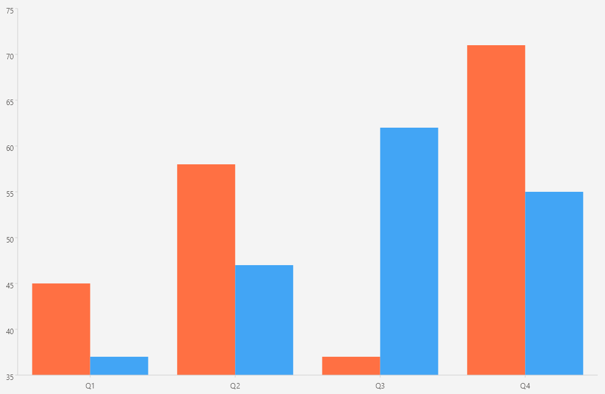

# .NET MAUI Cartesian Chart Palette

The Telerik UI for .NET MAUI CartesianChart applies colors to its series through a palette. You define a custom palette through the `Palette` property of the `RadCartesianChart`, which accepts a `ChartPalette` instance.

## Configuration

To define a custom palette, use the following types:

* `ChartPalette`&mdash;Represents the palette that is applied to the chart. It exposes the `Entries` collection.
* `ChartPaletteEntry`&mdash;Represents a single entry of the palette. Use the following properties to define the entry:
    * `FillColor` (`Color`)&mdash;Defines the color that is applied to a series.
    * `StrokeColor` (`Color`)&mdash;Defines the color that is applied to the series' stroke.

The palette entries apply to the series in the order in which the series are added to the chart.

## Example

The following example demonstrates how to apply a custom palette to two bar series.

1. Define the Chart with `BarSeries` and a `ChartPalette` instance and add two `ChartPaletteEntry` instances to it:

<snippet id='chart-cartesian-palette-xaml' />

2. Add the `charts` namespace:

```XAML
xmlns:charts="clr-namespace:Telerik.Maui.Controls.Charts;assembly=Telerik.Maui.Controls"
```

3. Define the data model:

<snippet id='chart-datamodel-multiseriesdata' />

4. Define the `ViewModel`:

<snippet id='chart-multiseries-viewmodel' />

This is the result:



> For a runnable example with the CartesianChart Palette scenario, go to the [SDKBrowser Demo Application]() and navigate to the **Charts > Features** category.

## See Also

- [Chart Plot Areas]()
- [AreaSeries]()
- [PointSeries]()
- [Categorical Axis]()