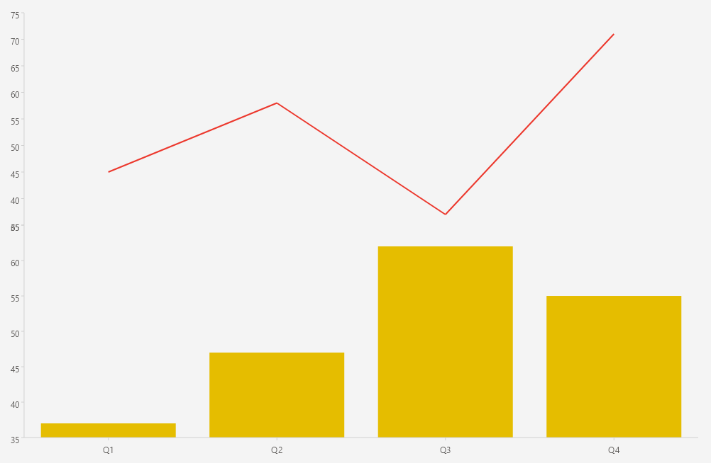

# .NET MAUI Cartesian Chart Plot Areas

The Telerik UI for .NET MAUI CartesianChart can split its rendering surface into separate plot areas. Each plot area hosts its own series and axes, which lets you stack multiple panes that share a common axis.

## Configuration

To define plot areas, use the following members:

* `PlotAreas`&mdash;The collection of `ChartPlotArea` instances defined on the `RadCartesianChart`.
* `ChartPlotArea`&mdash;Represents a single plot area. Assign it to the `PlotArea` property of an axis or a series to associate the element with the plot area.
* `PlotArea` (`ChartPlotArea`)&mdash;The property exposed by the axes and the series that associates the element with a specific plot area.

> Associate each axis and series with a plot area through the `PlotArea` property, and share an axis across plot areas by referencing the same axis instance.

## Example

The following example demonstrates how to split the chart into two plot areas that share a common categorical axis.

1. Define two `ChartPlotArea` instances in the `PlotAreas` collection of the `RadCartesianChart`.

<snippet id='chart-cartesian-plot-areas-xaml' />

2. Add the `charts` namespace:

```XAML
xmlns:charts="clr-namespace:Telerik.Maui.Controls.Charts;assembly=Telerik.Maui.Controls"
```

3. Define the data model:

<snippet id='chart-datamodel-multiseriesdata' />

4. Define the `ViewModel`:

<snippet id='chart-multiseries-viewmodel' />

This is the result:



> For a runnable example with the CartesianChart Plot Areas scenario, go to the [SDKBrowser Demo Application]() and navigate to the **Charts > Features** category.

## See Also

- [Categorical Axis]()
- [Numerical Axis]()
- [Date-Time Axis]()
- [Multiple Series]()
