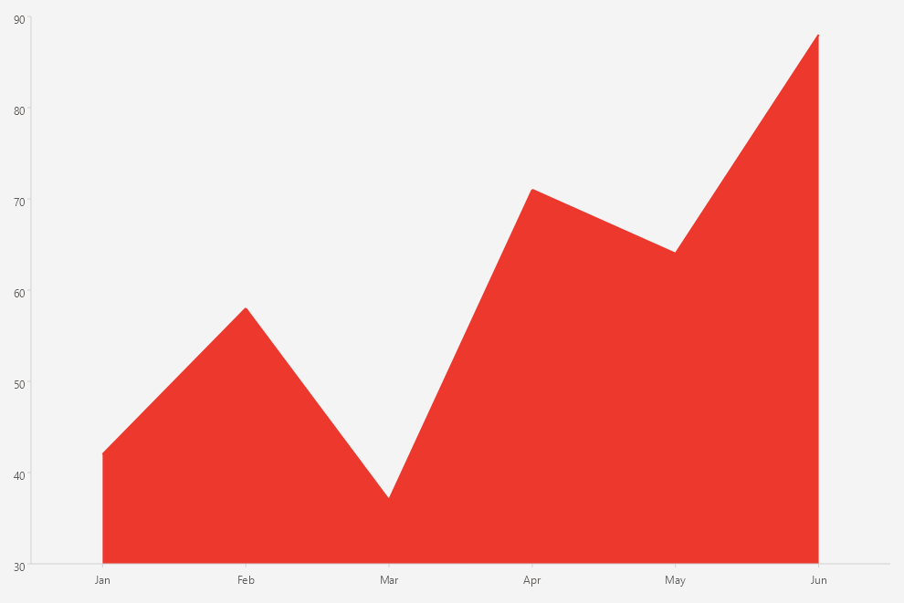

# .NET MAUI Cartesian Chart Area Series

The `AreaSeries` fills the area between the line that connects the data points and the axis.

## Features

The Area Series binds to data through the [common series properties]() (`ItemsSource`, `HorizontalBinding`, and `VerticalBinding`).

## Configuration and Styling

<snippet id='chart-cartesian-area-series-xaml' />

## See Also

- [Series Overview]()
- [Bar Series]()
- [Line Series]()
- [Point Series]()
- [Categorical Axis]()
