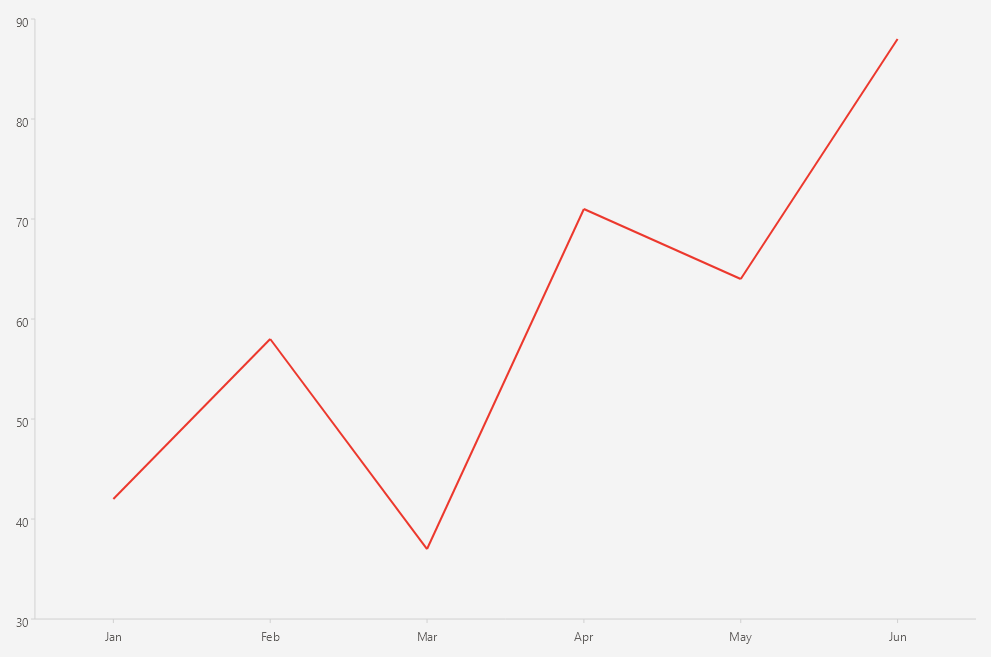

# .NET MAUI Cartesian Chart Line Series

The `LineSeries` connects the data points with straight line segments.

## Features

The Line Series binds to data through the [common series properties]() (`ItemsSource`, `HorizontalBinding`, and `VerticalBinding`).

## Configuration and Styling

Use the `StrokeThickness` property to control the thickness of the line.

<snippet id='chart-cartesian-line-series-xaml' />

## See Also

- [Series Overview]()
- [Bar Series]()
- [Area Series]()
- [Point Series]()
- [Categorical Axis]()
