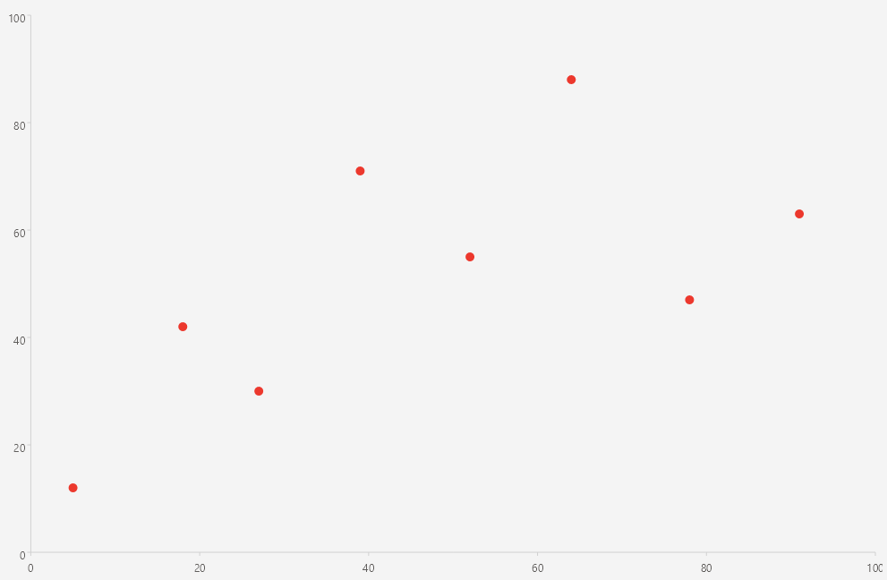

# .NET MAUI Cartesian Chart Point Series

The `PointSeries` represents each data point as a symbol positioned by two numerical values. It requires two `NumericalAxis` instances.

## Data Binding

The `PointSeries` binds to data through the following properties:

* `ItemsSource` (`IEnumerable`)&mdash;Defines the collection of data items that the series plots.
* `HorizontalBinding` (`string`)&mdash;Defines the name of the data-item member that provides the value of each point and this value is plotted along the horizontal axis.
* `VerticalBinding` (`string`)&mdash;Defines the name of the data-item member that provides the value of each point and this value is plotted along the vertical axis.
* `VerticalAxis` (`Telerik.Maui.Controls.Charts.ChartAxis`)&mdash;Defines the vertical axis for the series which values resolved from the `VerticalBinding` property are plotted against.
* `HorizontalAxis` (`Telerik.Maui.Controls.Charts.ChartAxis`)&mdash;Defines the horizontal axis for the series which values resolved from the `HorizontalBinding` property are plotted against.

## Point Customization

Use the following properties to customize the appearance of the points:

* `Fill` (`Brush`)&mdash;Defines the fill of the points.
* `PointSize` (`double`)&mdash;Defines the size of the points.
* `Stroke` (`Brush`)&mdash;Defines the brush to paint the stroke of the points.
* `StrokeThickness` (`double`)&mdash;Defines the thickness of the points stroke.

## Labels Customization

Use the following properties to configure the labels visualized for each data point:

* `ShowLabels` (`bool`)&mdash;Defines whether the axis labels will be displayed.
* `LabelOffset` (`Size`)&mdash;Defines the offset of the labels from the points.
* `LabelStyle` (`Style` with target type `ChartLabelAppearance`)&mdash;Defines the style of the axis labels.

<snippet id='chart-cartesian-point-series-xaml' />

This is the result:

> For a runnable example with the Cartesian Chart point series, go to the [SDKBrowser Demo Application]() and navigate to the **Charts > Series** category.

## See Also

- [BarSeries]()
- [LineSeries]()
- [AreaSeries]()
- [Categorical Axis]()
