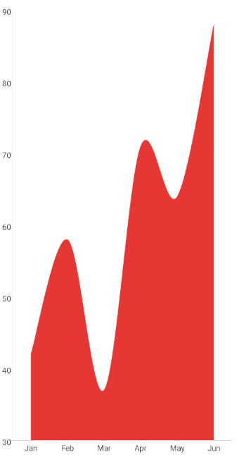

# .NET MAUI Cartesian Chart Spline Area Series

The `SplineAreaSeries` fills the area between the spline that connects the data points and the axis.

## Data Binding

The `SplineAreaSeries` binds to data through the following properties:

* `ItemsSource` (`IEnumerable`)&mdash;Defines the collection of data items that the series plots.
* `HorizontalBinding` (`string`)&mdash;Defines the name of the data-item member that provides the value of each data point and this value is plotted along the horizontal axis.
* `VerticalBinding` (`string`)&mdash;Defines the name of the data-item member that provides the value of each data point and this value is plotted along the vertical axis.
* `VerticalAxis` (`Telerik.Maui.Controls.Charts.ChartAxis`)&mdash;Defines the vertical axis for the series which values resolved from the `VerticalBinding` property are plotted against.
* `HorizontalAxis` (`Telerik.Maui.Controls.Charts.ChartAxis`)&mdash;Defines the horizontal axis for the series which values resolved from the `HorizontalBinding` property are plotted against.

## Spline Area Customization

Use the following properties to customize the appearance of the spline area:

* `Fill` (`Brush`)&mdash;Defines the fill of the spline area.
* `Stroke` (`Brush`)&mdash;Defines the brush to paint the stroke of the spline area.
* `StrokeThickness` (`double`)&mdash;Defines the thickness of the spline area stroke.

## Labels Customization

Use the following properties to configure the labels visualized for each data point:

* `ShowLabels` (`bool`)&mdash;Defines whether the axis labels will be displayed.
* `LabelOffset` (`Size`)&mdash;Defines the offset of the labels from the spline area.
* `LabelStyle` (`Style` with target type `ChartLabelAppearance`)&mdash;Defines the style of the axis labels.

## Example

The following example shows how to define a `SplineAreaSeries`.

1. Define the `SplineAreaSeries` and the chart definition in XAML:

<snippet id='chart-cartesian-spline-area-series-xaml' />

2. Add the `charts` namespace:
 
```XAML
xmlns:charts="clr-namespace:Telerik.Maui.Controls.Charts;assembly=Telerik.Maui.Controls"
```

3. Add the data model:

<snippet id='chart-datamodel-categorical-data' />

4. Add the `ViewModel`:

<snippet id='chart-categorical-viewmodel' />

This is the result:



> For a runnable example with the Cartesian Chart spline area series, go to the [SDKBrowser Demo Application]() and navigate to the **Charts > Series** category.

## See Also

- [BarSeries]()
- [LineSeries]()
- [PointSeries]()
- [Categorical Axis]()
