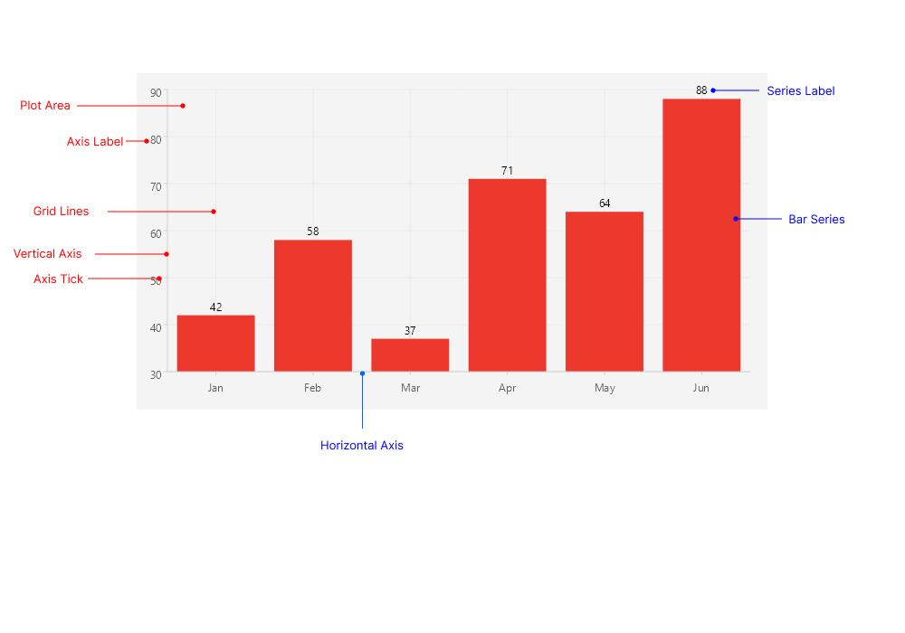

# .NET MAUI CartesianChart Visual Structure

The visual structure of the .NET MAUI CartesianChart represents the anatomy of the control. Being familiar with the visual elements of the CartesianChart allows you to quickly find the information required to configure them.

The following image shows the anatomy of the CartesianChart.

## Displayed Elements

- **Plot Area**&mdash;The area where the series render the data points, axis labels, and series.
- **Bar Series**&mdash;The visual representation of the data. The CartesianChart plots `BarSeries`, `LineSeries`, `AreaSeries`, and `PointSeries`.
- **Horizontal Axis**&mdash;The axis positioned along the horizontal direction. It is typically a `CategoricalAxis`, a `NumericalAxis`, or a `DateTimeAxis`.
- **Vertical Axis**&mdash;The axis positioned along the vertical direction. It is typically a `NumericalAxis`.
- **Axis Label**&mdash;The text that annotates the ticks of an axis.
- **Axis Tick**&mdash;The marks that indicate the values along an axis.
- **Grid Lines**&mdash;The optional horizontal and vertical lines rendered across the plot area.
- **Series Label**&mdash;The optional labels that annotate the individual data points of a series.

## See Also

- [Getting Started with the .NET MAUI CartesianChart]()
- [.NET MAUI Charts Product Page](https://www.telerik.com/maui-ui/charts)
- [.NET MAUI Charts Forum Page](https://www.telerik.com/forums/maui)
- [Telerik .NET MAUI Blogs](https://www.telerik.com/blogs/mobile-net-maui)
- [Telerik .NET MAUI Roadmap](https://www.telerik.com/support/whats-new/maui-ui/roadmap)
