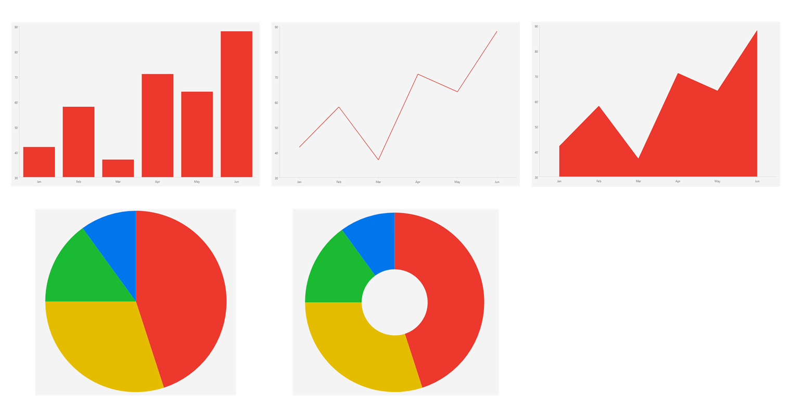

# .NET MAUI Charts Overview

The Telerik UI for .NET MAUI Charts provide a data-visualization solution built from two complementary chart controls. Each control targets a different plotting model and exposes its own series types, axes, and features, so that you can represent your data in the most suitable way.

## Charts

The Charts consist of the following controls:

* [CartesianChart]()&mdash;Plots data in a Cartesian coordinate system defined by horizontal and vertical axes. It renders `BarSeries`, `LineSeries`, `AreaSeries`, and `PointSeries`, and supports categorical, numerical, and date-time axes.
* [PieChart]()&mdash;Plots data as proportional slices of a circle. It renders `PieSeries` and `DonutSeries` and does not use axes.

## Next Steps

- [Getting Started with the .NET MAUI Cartesian Chart]()
- [Getting Started with the .NET MAUI Pie Chart]()

## See Also

- [.NET MAUI Charts Product Page](https://www.telerik.com/maui-ui/charts)
- [.NET MAUI Charts Forum Page](https://www.telerik.com/forums/maui)
- [Telerik .NET MAUI Blogs](https://www.telerik.com/blogs/mobile-net-maui)
- [Telerik .NET MAUI Roadmap](https://www.telerik.com/support/whats-new/maui-ui/roadmap)
