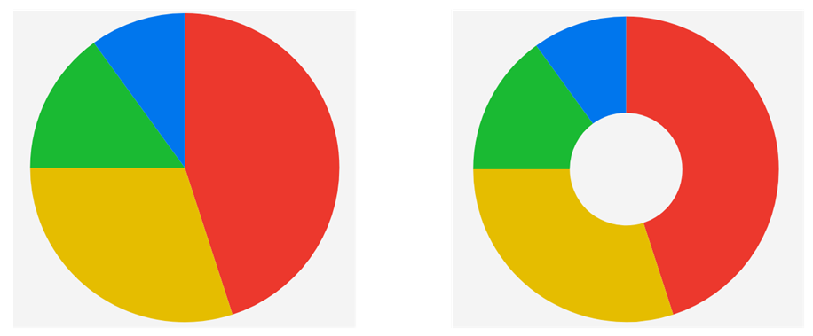

# .NET MAUI PieChart Overview

The Telerik UI for .NET MAUI PieChart (RadPieChart) displays data as a sliced circle, where each slice represents a single data point and its size reflects that point's value as a percentage of the total sum.

## Series

The PieChart plots data through the following series:

* [`PieSeries`]()&mdash;Represents the data points as slices of a full circle.
* [`DonutSeries`]()&mdash;Represents the data points as slices of a ring with a hollow center.

## Next Steps

- [Getting Started with the .NET MAUI PieChart]()
- [Visual Structure of the .NET MAUI PieChart]()

## See Also

- [.NET MAUI Charts Product Page](https://www.telerik.com/maui-ui/charts)
- [.NET MAUI Charts Forum Page](https://www.telerik.com/forums/maui)
- [Telerik .NET MAUI Blogs](https://www.telerik.com/blogs/mobile-net-maui)
- [Telerik .NET MAUI Roadmap](https://www.telerik.com/support/whats-new/maui-ui/roadmap)
