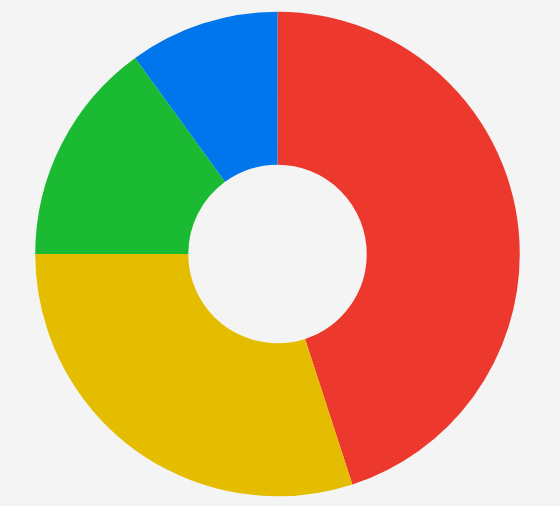

# .NET MAUI PieChart - Donut Series

The Telerik UI for .NET MAUI PieChart exposes a donut series. The donut series is used to visualize data in a circular graph, where each slice represents a proportion of the whole. The donut series is similar to the pie series, but it has a hole in the center, which can be used to display additional information or to create a more visually appealing chart.

## Data Binding

The donut series binds to data through the following properties:

* `ItemsSource` (`IEnumerable`)&mdash;Defines the collection of data items that the series plots.
* `ValueBinding` (`string`)&mdash;Defines the name of the data-item member that provides the value of each slice.
* `LabelBinding` (`string`)&mdash;Defines the name of the data-item member that provides the label of each slice.
* `IsVisible` (`bool`)&mdash;Defines a value indicating whether the series is visible.

## Radius Settings

Use the following properties to customize the appearance of the donut series:

* `RingGap` (`double`)&mdash;Defines the spacing, in device-independent units, left between this ring and adjacent donut rings when multiple `DonutSeries` instances are layered in the same plot area.  The default value is `4.0`
* `InnerRadiusFraction` (`double`)&mdash;Defines the fraction of the radius that is used for the inner hole of the donut series. The value is a fraction of the radius, where 0 is the center of the series and 1 is the edge of the series.
* `OuterRadiusFraction` (`double`)&mdash;Defines the fraction of the radius that is used for the outer edge of the donut series. The value is a fraction of the radius, where 0 is the center of the series and 1 is the edge of the series.
* `RadiusWeight` (`double`)&mdash;Defines the weight of the radius for the donut series. The default value is `1.0`, which means that the radius is equal to the size of the chart.

## Example

1. Define the donut series in XAML:

<snippet id='chart-donut-series-xaml' />

2. Add the `charts` namespace:

```XAML
xmlns:charts="clr-namespace:Telerik.Maui.Controls.Charts;assembly=Telerik.Maui.Controls"
```

3. Define the data model:

<snippet id='chart-datamodel-piedata' />

4. Define the `ViewModel`:

<snippet id='chart-pie-viewmodel' />

This is the result:

This is the result:



> For runnable examples with the PieChart donut series, go to the [SDKBrowser Demo Application]() and navigate to the **Charts > Series** category.

## See Also

- [Pie Series]()
