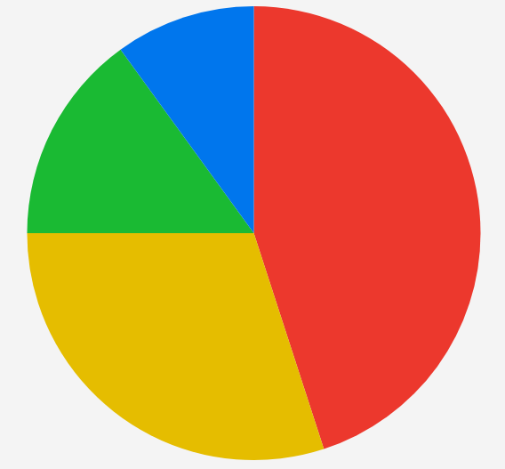

# .NET MAUI PieChart - Pie Series

The Telerik UI for .NET MAUI PieChart exposes a pie series. The pie series is used to visualize data in a circular graph, where each slice represents a proportion of the whole. 

## Data Binding

The pie series binds to data through the following properties:

* `ItemsSource` (`IEnumerable`)&mdash;Defines the collection of data items that the series plots.
* `ValueBinding` (`string`)&mdash;Defines the name of the data-item member that provides the value of each slice.
* `LabelBinding` (`string`)&mdash;Defines the name of the data-item member that provides the label of each slice.
* `IsVisible` (`bool`)&mdash;Defines a value indicating whether the series is visible.

## Labels Settings

Use the following properties to customize the appearance of the labels in the pie series:

* `LabelOffsetFraction` (`double`)&mdash;Defines the position of the labels relative to the radius of the series.
* `ShowLabels` (`bool`)&mdash;Defines a value indicating whether the labels are visible.
* `LabelStyle` (`ChartDataPointLabelStyle`)&mdash;Defines the style of the labels.

## Pie Settings

Use the following properties to customize the appearance of the pie series:

* `Stroke` (`Brush`)&mdash;Defines the brush of the stroke of the slices.
* `StrokeThickness` (`double`)&mdash;Defines the thickness of the stroke of the slices.

## Example

1. Define the pie series in XAML:

<snippet id='chart-pie-series-xaml' />

2. Add the `charts` namespace:

```XAML
xmlns:charts="clr-namespace:Telerik.Maui.Controls.Charts;assembly=Telerik.Maui.Controls"
```

3. Define the data model:

<snippet id='chart-datamodel-piedata' />

4. Define the `ViewModel`:

<snippet id='chart-pie-viewmodel' />

This is the result:

This is the result:



> For runnable examples with the PieChart pie series, go to the [SDKBrowser Demo Application]() and navigate to the **Charts > Series** category.

## See Also

- [Donut Series]()