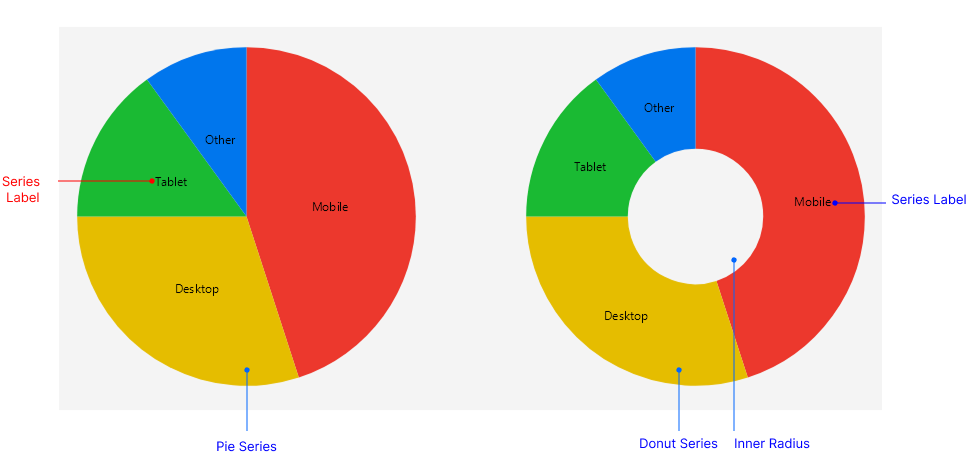

# .NET MAUI PieChart Visual Structure

The visual structure of the .NET MAUI PieChart represents the anatomy of the control. Being familiar with the visual elements of the PieChart allows you to quickly find the information required to configure them.

The following image shows the anatomy of the PieChart.

## Displayed Elements

- **Pie Series**&mdash;The arc segments that represent the data points. The size of each slice is proportional to the value of the data point.
- **Donut Series**&mdash;The arc segments that represent the data points. The size of each slice is proportional to the value of the data point.
- **Inner Radius**&mdash;The hollow center of a `DonutSeries`, controlled by the `InnerRadiusFactor` property.
- **Series Labels**&mdash;The text that annotates each slice, positioned through the `LabelOffsetFraction` property.

## See Also

- [Getting Started with the .NET MAUI PieChart]()
- [.NET MAUI Charts Product Page](https://www.telerik.com/maui-ui/charts)
- [.NET MAUI Charts Forum Page](https://www.telerik.com/forums/maui)
