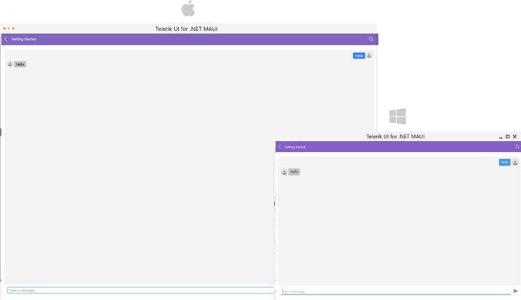
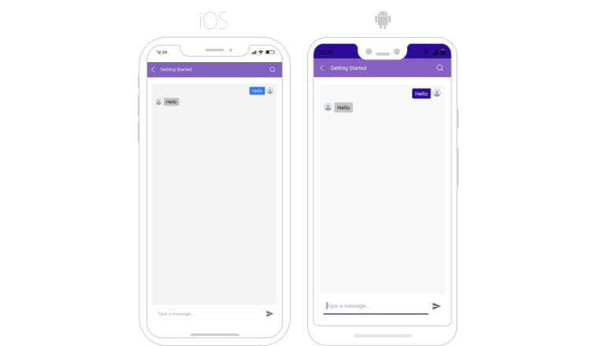

# Getting Started with the .NET MAUI Chat

This guide provides the information you need to start using the Telerik UI for .NET MAUI Chat by adding the control to your project.

At the end, you will achieve the result on the first image for desktop platforms and the results on the second image for mobile platforms:





## Prerequisites

Before adding the Chat, you need to:

1. [Set up your .NET MAUI application](#step-1-set-up-your-net-maui-application).

1. [Download Telerik UI for .NET MAUI](#step-2-download-telerik-ui-for-net-maui).

1. [Install Telerik UI for .NET MAUI](#step-3-install-telerik-ui-for-net-maui).

## Define the Control

1. When your .NET MAUI application is set up, you are ready to add a `RadChat` control to your page.

 ```XAML
<telerik:RadChat x:Name="chat"/>
 ```

1. Add the following namespace:

 ```XAML
xmlns:telerik="http://schemas.telerik.com/2022/xaml/maui"
 ```

1. Register the Telerik controls through the `Telerik.Maui.Controls.Compatibility.UseTelerik` extension method called inside the `CreateMauiApp` method of the `MauiProgram.cs` file of your project:

 ```C#
 using Telerik.Maui.Controls.Compatibility;

 public static class MauiProgram
 {
	public static MauiApp CreateMauiApp()
	{
		var builder = MauiApp.CreateBuilder();
		builder
			.UseTelerik()
			.UseMauiApp<App>()
			.ConfigureFonts(fonts =>
			{
				fonts.AddFont("OpenSans-Regular.ttf", "OpenSansRegular");
			});

		return builder.Build();
	}
 }           
 ```

## Additional Resources

- [MVVM Support]()
- [Commands]()
- [Chat Items]()
- [Suggested Actions]()

## See Also

- [.NET MAUI Chat Product Page](https://www.telerik.com/maui-ui/chat-(conversational-ui))
- [.NET MAUI Chat Forum Page](https://www.telerik.com/forums/maui?tagId=2061)
- [Telerik .NET MAUI Blogs](https://www.telerik.com/blogs/mobile-net-maui)
- [Telerik .NET MAUI Roadmap](https://www.telerik.com/support/whats-new/maui-ui/roadmap)
