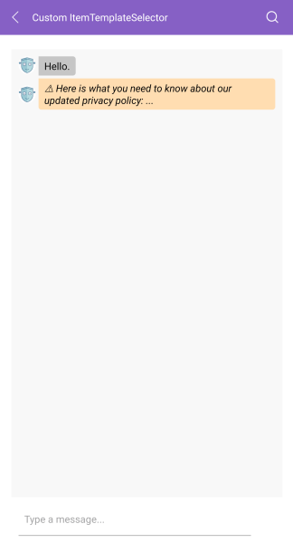

# .NET MAUI Chat `ItemTemplateSelector`

The `RadChat` control exposes an `ItemTemplateSelector` property which you can use to apply different templates to each Chat item depending on a specific condition.

## Default `ItemTemplateSelector`

Any change in the appearance of the Chat items depends on the `ChatItemTemplateSelector` and the containing templates and referenced styles. The default selector includes separate templates for the incoming and outgoing messages (so they're aligned to the left or right) and for single, first, middle, and last messages (in the case there area a few messages in a row)—this is needed to achieve the "balloon" look & feel of the messages. In addition, the `TimeBreak` template is also assigned through the `ItemTemplateSelector`.

Below you can find the default `ItemTemplateSelector`, which you can use as a base for any further customizations to the way the messages look. 

The default templates contain:
* a `RadBorder` control (used to achieve the rounded edges).
* an `Image` control (used for the avatar image only for the single and first messages).
* a `Label` for the text message itself. 

The code snippet below contains the default templates and the accompanying styles:

<snippet id='chat-features-defaultitemtemplate-resources' />

You can apply any changes to the templates and then assign the template selector to the `ItemTemplateSelector` property of the Chat control:

<snippet id='chat-features-defaultitemtemplate-xaml' />

## Custom `ItemTemplateSelector`

You can create a custom `ChatItemTemplateSelector` to conditionally apply different message styles depending on any of the used Chat item properties.

The following example demonstrates how to create a custom `ChatItemTemplateSelector`:

**1.** To apply a distinct style to the important messages, add the following `ChatItem` class with a custom `MessageCategory` property: 

<snippet id='chat-features-itemtemplate-chatitem' />

**2.** Add a few sample Items to the Chat's `ItemsSource`:

<snippet id='chat-features-itemtemplate-items' />

> You need to supply an `ItemsConverter` as you're using custom items as demonstrated inside MVVM Support topic.

<snippet id='chat-features-itemtemplate-itemconverter' />

**3.** Create a `CustomChatItemTemplateSelector` class that derives from the `ChatItemTemplateSelector`:

<snippet id='chat-features-itemtemplate-templateselector' />
	
**4.**  Create the needed XAML resources:

<snippet id='chat-features-itemtemplate-resources' />

**5.** Set it to the Chat's `ItemTemplateSelector` property:

<snippet id='chat-features-itemtemplate-xaml' />

The image below shows how the customized Chat control could look:

## See Also

- [MVVM Support]()
- [Commands]()
