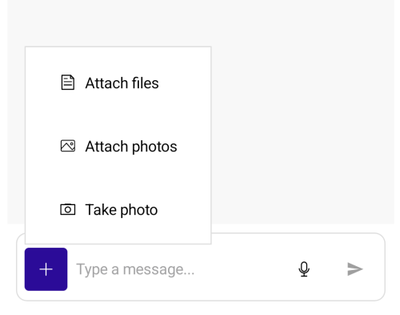

# Chat Attachments

The Telerik UI for .NET MAUI Chat control allows you to send and receive attachments as part of the conversation. Attachments can include images, documents, or other file types that enhance the messaging experience.

>tip When working with attachments, you need to grant permissions to access the device camera and device external storage. For more details, review the [Microsoft Media Picker](https://learn.microsoft.com/en-us/dotnet/maui/platform-integration/device-media/picker?view=net-maui-10.0&tabs=android) article.

To add attachments you have to apply the following settings:

1. Set the `IsMoreButtonVisible` to `true` to show the More button in the input area of the Chat control.
2. Bind the `SendMessageCommand` to the command that sends the message.
3. Bind the `AttachedFilesSource` to the collection of files to be sent. This is the items source from which the chat populates the `Telerik.Maui.Controls.RadChat.AttachedFiles` collection, i.e. the files that are to be uploaded and have not yet been sent.
4. Bind the `AttachFilesCommand` to the command that handles file attachment. The command executes when the files the end-user picked need to be attached/uploaded.
5. Set the `AttachedFileConverter`. This is the converter that performs the conversion between a data item representing an attached file and a `Telerik.Maui.Controls.Chat.ChatAttachedFile`.

## Example with AttachFilesCommand

1. Define the `RadChat` component:

<snippet id='chat-attachments-xaml' />

2. Add the `ViewModel` with the `AttachFilesCommand` definition:

<snippet id='chat-with-attachments-view-model' />

3. Create a sample `MessageItem` model:

<snippet id='chat-message-item' />

4. Create `AttachmentsItem` class and define the attachments collection property:

<snippet id='chat-attachments-item' />

5. Define an `AttachmentData` class to hold the attachment information:

<snippet id='chat-attachment-data' />

6. Define the custom class for the attachments file data:

<snippet id='chat-attached-file-data' />

7. Define a converter to convert a data item to a chat attachment. In general here you need to create and set up the corresponding `Telerik.Maui.Controls.Chat.ChatAttachedFile` for the given business object: 

<snippet id='chat-attached-file-converter' />

8. Define a custom converter that converts from chat specific objects to business objects, so that the `ViewModel` does not have to handle chat specific classes:

<snippet id='chat-attached-file-command-converter' />

9. The `ItemConverter` is need in MVVM scenario as custom items are used:

<snippet id='chat-attachment-item-converter' />

10. The demo uses a custom data file server for uploading, downloading and deleting attachments:

<snippet id='chat-data-server' />

## See Also

- [Commands]()
- [Chat Items]()
- [Attachment Styling]()
- [Attachment Templates]()