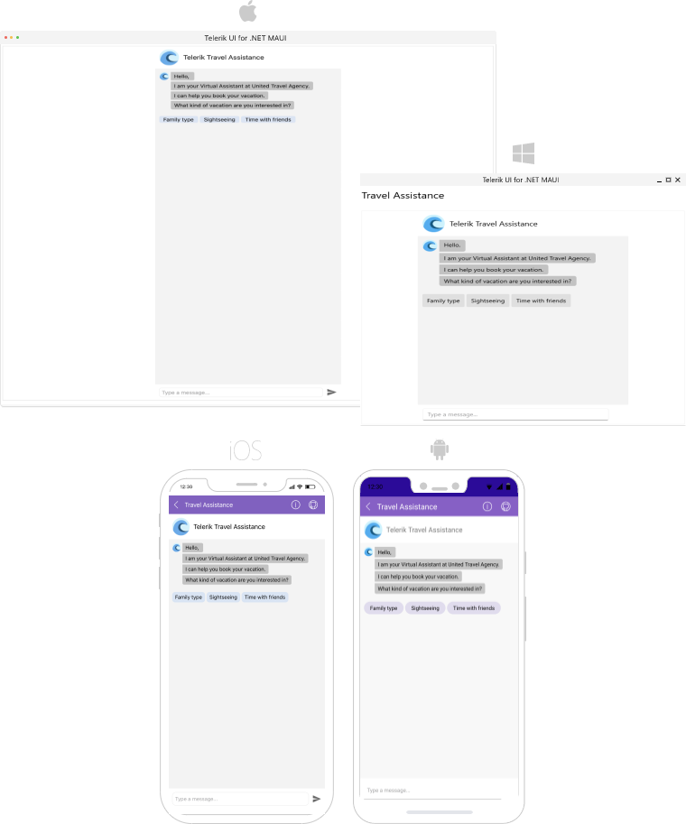

# .NET MAUI Conversational UI (Chat) Overview

The Telerik UI for .NET MAUI Chat is a UI component that enables the implementation of conversational UI in .NET MAUI applications. It allows for use of a chatbot framework, following a predefined logical tree, or integrating peer-to-peer chat capabilities.

## Key Features

* [A variety of chat items for great user experience]()&mdash;You can choose between simple text messages, various pickers, such as list view, calendar, date and time pickers, and cards.
* [Typing indicator]()&mdash;Use the typing indicator to let the users that other Chat participants are currently typing.
* [Template Selectors]()&mdash;Apply different templates to each Chat items. 
* [Predefined List of Suggestions]()&mdash;This feature allows you to have a predefind list of suggestions. So the users of the Chat can choose between predefined items before sending a message. 
* [MVVM support]()&mdash;With the `RadChat` control, you can use the Model-View-ViewModel pattern. You can achieve this by bounding the `ItemsSource` property to a collection of any data items that will be converted into chat items.
* [Commands support]()&mdash;Part of the MVVM support. You can execute a command when sending messages. 
* [Localization support](#localization)&mdash;Translate the phrases used across the Chat control to other languages so that you can adapt your app to different regions.

## Next Steps

- [Getting Started with Telerik UI for .NET MAUI Conversational UI]()

## See Also

- [.NET MAUI Chat Product Page](https://www.telerik.com/maui-ui/chat-(conversational-ui))
- [.NET MAUI Chat Forum Page](https://www.telerik.com/forums/maui?tagId=2061)
- [Telerik .NET MAUI Blogs](https://www.telerik.com/blogs/mobile-net-maui)
- [Telerik .NET MAUI Roadmap](https://www.telerik.com/support/whats-new/maui-ui/roadmap)
