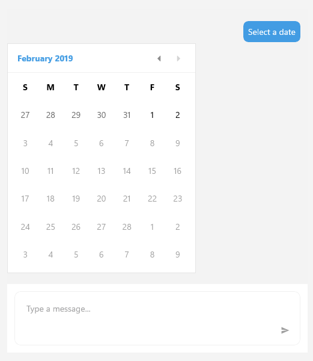

# .NET MAUI Chat DatePicker

The `RadChatPicker` control provides a `DatePickerContext` that you can use to display a calendar and allow the user to choose a date.

`DatePickerContext` exposes the following properties that allow you to show a list of possible options to the user:

* `SelectedDate`&mdash;Defines the currently selected date;
* `MinDate`&mdash;Defines the min date that can be displayed and selected;
* `MaxDate`&mdash;Defines the max date that can be displayed and selected;

Here is a quick example on how to user DatePicker:

<snippet id='chat-chatpicker-datepicker' />
	
>caption Chat with DatePicker

## See Also

- [ChatPicker]()
- [TimePicker]()
- [ItemPicker]()
- [CardPicker]()