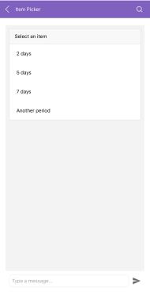

# .NET MAUI Chat ItemPicker 

The `RadChatPicker` control provides an `ItemPickerContext` that can be used to display a list of options the end user could choose from.

`ItemPickerContext` exposes the following properties you could use to provide a list of possible options to the user:

* `ItemsSource`&mdash;Defines the data source used to generate the content of the ItemPicker control;
* `SelectionMode`&mdash;Defines whether users are allowed to select one or many items out of the provided ItemsSource;
* `SelectedItems`&mdash;Defines the currently selected items;
* `SelectedItem`&mdash;Defines the last selected item;

Here is a quick example on how to user ItemPicker:

<snippet id='chat-chatpicker-itempicker' />
	
#### Figure 1: Chat with ItemPicker

## See Also

- [ChatPicker]()
- [DatePicker]()
- [TimePicker]()
- [CardPicker]()