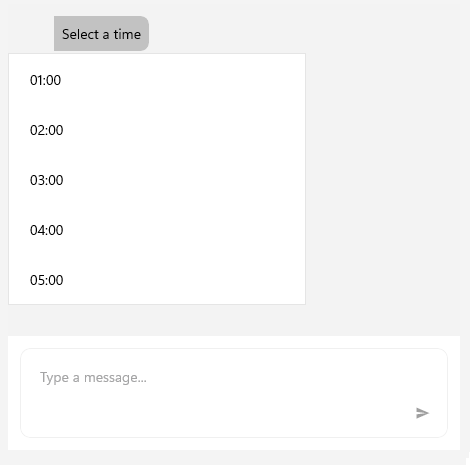

# .NET MAUI Chat TimePicker 

The `RadChatPicker` control provides a `TimePickerContext` that can be used to display a clock view to choose a time.

`TimePickerContext` exposes the following properties that you can use to adjust the clock items:

* `SelectedValue`&mdash;Defines the currently selected time.
* `StartTime`&mdash;A property of type `TimeSpan` that represents the starting time of the clock's items.
* `EndTime`&mdash;A property of type `TimeSpan` that corresponds to the time of the last clock item.
* `TimeInterval`&mdash;A property of type `TimeSpan` that defines the step between the clock's items. Te default value is 1 hour.

Here is a quick example on how to use the TimePicker in `RadChat`:

<snippet id='chat-chatpicker-timepicker' />
	
>caption Chat with TimePicker

## See Also

- [ChatPicker]()
- [ItemPicker]()
- [CardPicker]()