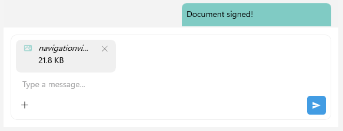
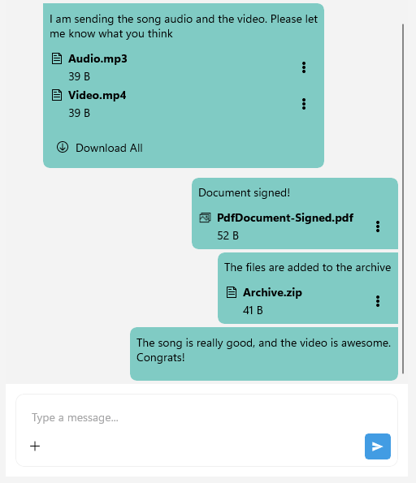

# .NET MAUI Chat Attachments Styling

Any change in the appearance of the `RadChat` components depends on the referenced styles.

>tip When working with attachments, you need to grant permissions to access the device camera and device external storage. For more details, review the [Microsoft Media Picker](https://learn.microsoft.com/en-us/dotnet/maui/platform-integration/device-media/picker?view=net-maui-10.0&tabs=android) article.

## Style the Attachments in the Input Area

The Telerik UI for .NET MAUI Chat control allows you to customize the appearance of the attachments in the input area, by using the `ChatInputAreaAttachedFileItemView` as implicit style. The `ChatInputAreaAttachedFileItemView` exposes the following properties for customization:

* `ImageStyle` (`Style` with target type `Image`)&mdash;Defines the style of the icon of the attached file.
* `SubtitleStyle` (`Style` with target type `Label`)&mdash;Defines the style of the label representing the size of the attached file.
* `TitleStyle` (`Style` with target type `Label`)&mdash;Defines the style of the label representing the name of the attached file.
* `RemoveButtonStyle` (`Style` with target type `RadTemplatedButton`)&mdash;Defines the style of the remove button used to remove the attached file from the input area.

Here is an example for styling the attachments in the messages:

<snippet id='chat-styling-attached-file' />

And the needed converter for the images inside the attachments icon in the input area:

<snippet id='chat-styling-attachments-imagestyle' />

This is the result:

> For a runnable example with Styling the Chat Attachments in the Input Area, see the [SDKBrowser Demo Application]() and go to **Chat > Features** category.

## Style the Attachments in the Messages

To customize the appearance of the attachments in the messages, you can use the `ChatAttachmentsMessageView` as an implicit style. The `ChatAttachmentsMessageView` exposes the following properties for customization:

* `BorderStyle` (`Style` with target type `RadBorder`)&mdash;Defines the style of the border of the message with the attachments.
* `LabelStyle` (`Style` with target type `Label`)&mdash;Defines the style of the label in the attached messages.
* `AttachmentsListViewStyle` (`Style` with target type `ChatMessageAttachmentsListView`)&mdash;Defines the style of the list view containing the attached files in the message. The properties for customizing the list view are:
  * `DownloadAllButtonStyle` (`Style` with target type `RadTemplatedButton`)&mdash;Defines the style for the Download All button used to download all attached files in the message.
  * `AttachmentStyle` (`Style` with target type ChatMessageAttachmentView`)&mdash;Defines style of the image (the avatar's icon) of the attachments message
	* `ImageStyle` (`Style` with target type `Image`)&mdash;Defines the style of the icon of the attached file in the message area.
	* `SubtitleStyle` (`Style` with target type `Label`)&mdash;Defines the style of the label representing the size of the attached file in the message area.
	* `TitleStyle` (`Style` with target type `Label`)&mdash;Defines the style of the label representing the name of the attached file in the message area.
	* `ActionsViewStyle` (`Style` with target type `ChatMessageAttachmentActionsView`)&mdash;Defines the style of the actions view containing the download and remove buttons for the attached file in the message area. The properties for customizing the actions view are:
		* `MenuButtonStyle` (`Style` with target type `Image`)&mdash;the custom image style that represents the attachment icon.

In addition, you can style the incoming and outgoing attachments messages separately targeting the following implicit styles:

* `ChatIncomingAttachmentsMessageView`&mdash;Represents all incoming attachments messages.
* `ChatIncomingFirstAttachmentsMessageView`&mdash;Represents a view that visualizes the first incoming attachments message, out of a few consecutive messages from the same author.
* `ChatIncomingMiddleAttachmentsMessageView`&mdash;Represents a view that visualizes the middle incoming attachments message, out of a few consecutive messages from the same author.
* `ChatIncomingLastAttachmentsMessageView`&mdash;Represents a view that visualizes the last incoming attachments message, out of a few consecutive messages from the same author.
* `ChatIncomingSingleAttachmentsMessageView`&mdash;Represents a view that visualizes a single incoming attachments message, out of a few consecutive messages from the same author.

* `ChatOutgoingAttachmentsMessageView`&mdash;Represents all outgoing attachments messages.
* `ChatOutgoingFirstAttachmentsMessageView`&mdash;Represents a view that visualizes the first outgoing attachments message, out of a few consecutive messages from the same author.
* `ChatOutgoingMiddleAttachmentsMessageView`&mdash;Represents a view that visualizes the middle outgoing attachments message, out of a few consecutive messages from the same author.
* `ChatOutgoingLastAttachmentsMessageView`&mdash;Represents a view that visualizes the last outgoing attachments message, out of a few consecutive messages from the same author.
* `ChatOutgoingSingleAttachmentsMessageView`&mdash;Represents a view that visualizes a single outgoing attachments message, out of a few consecutive messages from the same author.

Use the properties listed for the `ChatAttachmentsMessageView` for the customization of the incoming and outgoing attachments messages.

Here is an example for styling the `ChatAttachmentsMessageView` and `ChatOutgoingAttachmentsMessageView`:

<snippet id='chat-styling-attachments-messages' />

And the needed converter for the attachments icon inside the messages area:

<snippet id='chat-styling-image-outgoing-messages' />

This is the result:

> For a runnable example with Styling the Chat Attachments in the Messages, see the [SDKBrowser Demo Application]() and go to **Chat > Features** category.

## See Also

- [Commands]()
- [Chat Items]()
- [MVVM Support]()