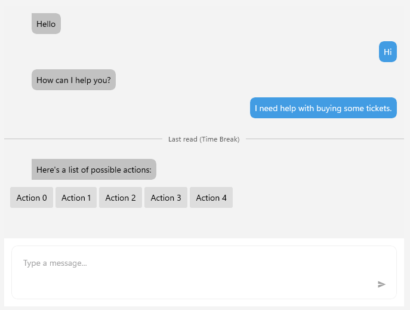

# .NET MAUI Chat Suggested Actions

The `RadChat` control enables you to add suggestions for the users. You can achieve this by adding `SuggestedActionsItem` instances to the `Items` collection of `RadChat`.

### Adding the Suggested Actions 

The following example demonstrates how to create and set up a `SuggestedActionsItem`:

<snippet id='chat-suggested-actions-code' />

Then, the `GetSuggestedActions` method populates the `Actions` property with a collection of `SuggestedAction` items:

<snippet id='chat-suggested-actions-collection' />

>caption `RadChat` with suggested actions

## See Also

- [Commands]()