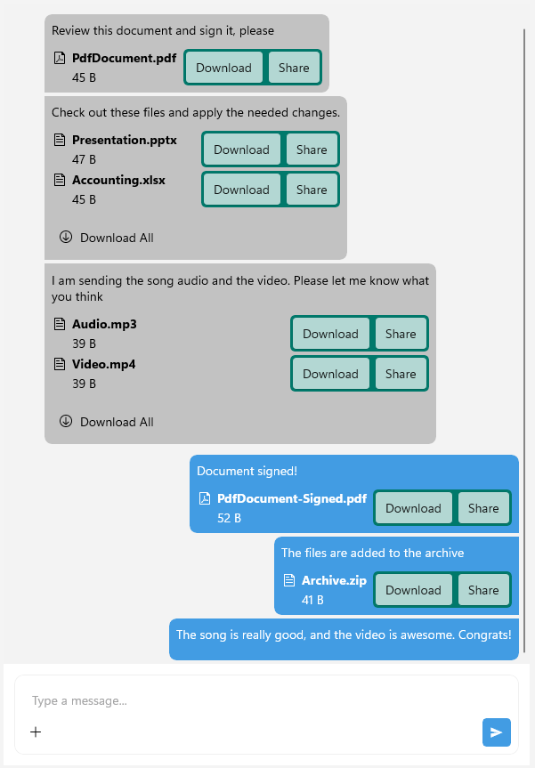

# .NET MAUI Chat Attachments Templates

The Telerik UI for .NET MAUI Chat control allows you to customize the appearance of the attachments in both the input area and the messages by changing the default template of the `ChatInputAreaAttachedFileItemView`.

>tip When working with attachments, you need to grant permissions to access the device camera and device external storage. For more details, review the [Microsoft Media Picker](https://learn.microsoft.com/en-us/dotnet/maui/platform-integration/device-media/picker?view=net-maui-10.0&tabs=android) article.

## Customize the Attachments Template in the Input Area

To customize the appearance of the attachments in the input area, you can define a custom `ControlTemplate` for the `ChatInputAreaAttachedFileItemView`.

## Customize the Attachments Template in the Messages

To customize the appearance of the attachments in the messages, you can define a custom `ControlTemplate` in the `ChatMessageAttachmentView`. Below is an example of how to create a custom template for the attachments in the messages:

<snippet id='chat-attachments-view-templates' />

And the final result:

### Customize the Attachment Actions Template

You can also customize the actions template of the attachments in the messages by defining a custom `ControlTemplate` for the `ChatMessageAttachmentActionsView`. 

Here is an example of how to create a custom actions template for the attachments in the messages:

<snippet id='chat-attachments-actionsview-templates' />

And the final result:

> For a runnable example with the Chat Attachments Template, see the [SDKBrowser Demo Application]() and go to **Chat > Features** category.

## See Also

- [Commands]()
- [Chat Items]()