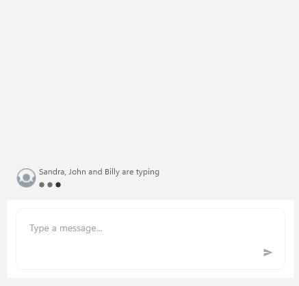

# .NET MAUI Chat Typing Indicator

The `TypingIndicator` functionality of RadChat can be used to indicate that a participant (or participants) is currently typing.

By default, the `TypingIndicator` is not visible. As soon as its `Authors` (or ItemsSource) collection is updated, it is displayed with a text message indicating the authors' names. It can also be displayed explicitly by setting the `IsTyping` and/or `IsVisible` properties to `true`.

The text message is built according to the count of authors like this:

* If the collection of Authors contains 1 item: "[Author name] is typing";
* If there are two authors: "[Author1 name] and [Author2 name] are typing";
* In case of three authors: "[Author1 name], [Author2 name] and [Author3 name] are typing";
* In case of more authors: "[Author1 name], [Author2 name] and 2 others are typing";

When the Authors (or `ItemsSource`) collection is cleared, the `TypingIndicator` is hidden.

In addition, by setting the `Text` property of the indicator, the text message could be replaced with any other of your choice.

#### Adding a TypingIndicator

To add a typing indicator, just set the `TypingIndicator` property of the RadChat control:

<snippet id='chat-typingindicator-xaml' />
	
There are then two ways to display the typing indicator:

#### Using the Authors collection:

You can use directly `Authors` collection which is of type `ObservableCollection<Author>` to show the participants who are currently typing. Here is a quick example:

<snippet id='chat-typingindicator-authors-code' />

And the result is:

#### Figure 1: RadChat with typing indicator

## See Also

- [Commands]()
- [Chat Items]()
- [MVVM Support]()
