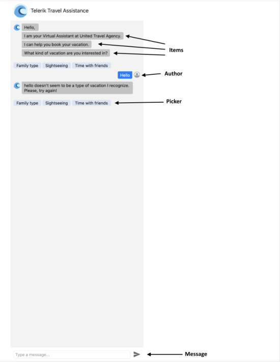

# .NET MAUI Chat Visual Structure

RadChat exposes the following properties you could use to setup the component:

## Legend

- `Author`&mdash;Represents the current user who sends messages using the Chat UI. This instance determines the messages alignment – incoming messages are placed on the left, outgoing messages - on the right;
- `Items`&mdash;Contains all the chat items included in the conversation such TextMessages, PickerItems, etc. For more details on the available chat items go to [Chat Items](slug %%) topic.
- `Message`&mdash; defines the current message typed into the input field
- `Send Button`&mdash; defines the button used to send messages
- `Picker`&mdash;Defines the ChatPicker that is shown either as overlay over the messages’ view or inline as part of the conversation and could display different pickers in order to provide the end user with a selection of choices. Go to ChatPicker topic for more details on the matter.
- `Typing Indicator`&mdash;Defines the indicator which is shown when one of the chat authors is typing

## See Also

- [Commands]()
