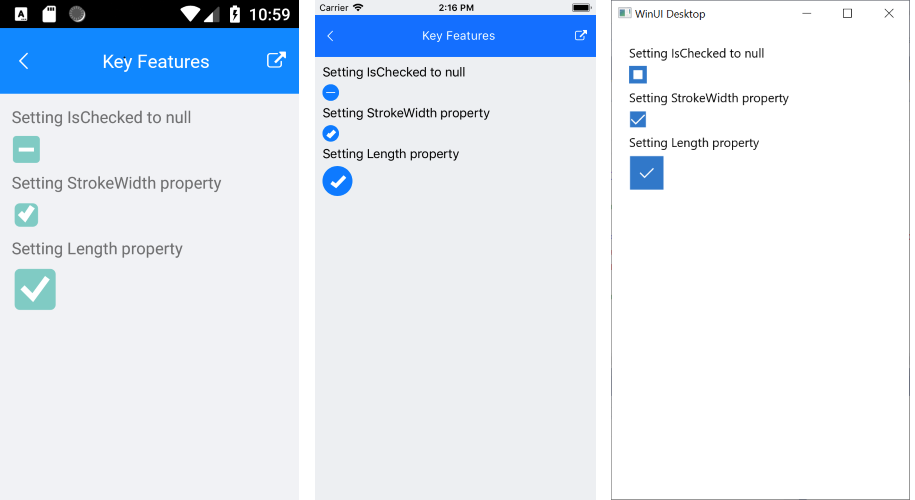

# .NET MAUI CheckBox Animation

The CheckBox provides built-in animation when changing the state of the control&mdash;`Checked`,`Unchecked`, and `Indeterminate`.



To remove the built-in animation, use the `IsAnimated` (`bool`) property. The default value is `true`.

The following example demonstrates how to set the `IsAnimated` property.

```XAMl
<telerik:RadCheckBox x:Name="checkboxLength" IsAnimated="False" />
```

The videos below shows how the control changes the states when the animation is disabled:


## See Also

- [Defining the Checkbox State]()
- [Styling Options of the Checkbox]()
