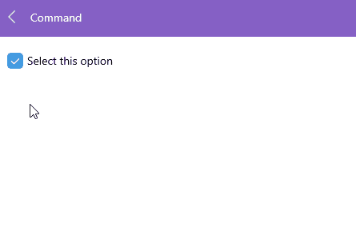

# Check States for .NET MAUI CheckBox

The CheckBox enables you to define its state as `Checked`, `Unchecked`, or `Indeterminate`.

The state is controlled through the `IsChecked`(`bool?`) property. You can set all states either through the UI or programmatically. The `Indeterminate` state can be applied through the UI only for three-state checkboxes. `IsChecked` property binding mode is `TwoWay`.

* `Checked` state&mdash;When `IsChecked` is `true`.

* (Default) `Unchecked` state&mdash;When `IsChecked` is `false`.

* `Indeterminate` state&mdash;When `IsChecked` is `null`.

* `IsThreeState` (`bool`)&mdash;Defines whether you can apply the indeterminate state through the UI. When `IsThreeState` is `true`, it allows the end user to go to the indeterminate state along with the `Checked` and `Unchecked` states. By default, `IsThreeState` is `false`.

The following example demonstrates how to set the `IsChecked` property.

Define the checked state of the CheckBox.

```XAML
<telerik:RadCheckBox x:Name="checkboxIsChecked" 
					 IsChecked="{Binding IsChecked}" 
				     IsThreeState="True" />
```

Set the ViewModel.

```C#
public class ViewModel : NotifyPropertyChangedBase
{
    private bool? isChecked;

    public bool? IsChecked
    {
        get { return this.isChecked; }
        set
        {
            if (this.isChecked != value)
            {
                this.isChecked = value;
                OnPropertyChanged();
            }
        }
    }
}
```

## Events

* `IsCheckedChanged`&mdash;Occurs when the `RadCheckBox.IsChecked` property is changed. The `IsCheckedChanged` event handler receives two parameters:
    * The `Sender` which is of type `Telerik.Maui.Controls.RadCheckBox`.
    * and `IsCheckedChangedEventArgs`. The `IsCheckedChangedEventArgs` provides the following properties:
        * `NewValue`(`bool?`)&mdash;Gets the new value from the CheckBox state.
        * `OldValue`(`bool?`)&mdash;Gets the old value of the CheckBox state.

## Commands

The Telerik .NET MAUI CheckBox allows you to attach a command that executes when the `IsChecked` property changes. 

* `Command` (`ICommand`)&mdash;Defines the command, which executes when the `IsChecked` property of the checkbox changes. Use `CommandParameter` to pass a parameter to the command execute method. The `Command` is available in .NET 8.

Here is an example with the `CheckBox.Command`

**1.** Define the CheckBox in XAML:

<snippet id='checkbox-command-xaml' />

**2.** Define the ViewModel:

<snippet id='checkbox-command-viewmodel' />

Here is the result:



## See Also

- [Styling Options of the Checkbox]()
