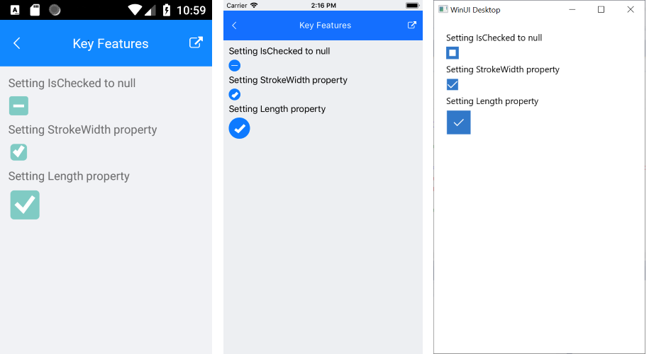

# Checked States

The CheckBox enables you to define its state as Checked, Unchecked, or Indeterminate.

The state is controlled through the `IsChecked` property, which is of the `bool?` type. You can set all states either through the UI or programmatically. The **Indeterminate** state can be applied through the UI only for three-state checkboxes.

* Checked state&mdash;When `IsChecked` is set to `true`.
* (Default) Unchecked state&mdash;When `IsChecked` is set to `false`.
* Indeterminate state&mdash;When `IsChecked` is `null`.
* `IsThreeState` (`bool`)&mdash;Defines whether you can apply the Indeterminate state through the UI. When `IsThreeState` is `true`, it allows the end user to go to the Indeterminate state along with the Checked and Unchecked states. By default, `IsThreeState` is set to `false`.

The following example demonstrates how to set the `IsChecked` property.

```XAMl
<telerikPrimitives:RadCheckBox x:Name="checkboxIsChecked" IsChecked="{Binding IsChecked}" IsThreeState="True" />
```

The following example demonstrates how set the `ViewModel`.

```C#
public class ViewModel : NotifyPropertyChangedBase
{
    private bool? isChecked;

    public bool? IsChecked
    {
        get { return this.isChecked; }
        set
        {
            if (this.isChecked != value)
            {
                this.isChecked = value;
                OnPropertyChanged();
            }
        }
    }
}
```

The image below shows the result at runtime displaying the defined Indeterminate state together with the configured `StrokeWidth` and `Length` properties.




## See Also

- [Setting the Checkbox Dimensions]()
- [Styling Options of the Checkbox]()
