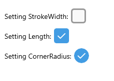
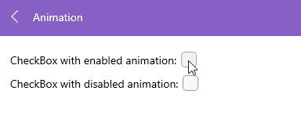
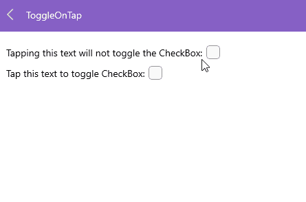

# .NET MAUI CheckBox Styling

The CheckBox provides a set of properties for customizing its visual appearance.

The image below shows a configuration of the CheckBox size, stroke and corner radius:



## Size

To define the dimensions of the control (height and width), use the `Length` (`double`) property, which maintains a 1:1 aspect ratio. The default value is `18`.

The following example demonstrates how to set the `Length` value.

<snippet id='checkbox-length' />

> For a runnable example with the CheckBox Size scenario, see the [SDKBrowser Demo Application]() and go to **CheckBox > Features** category.

## Stroke Thickness

The CheckBox exposes a `StrokeWidth` (`double`) property that specifies the width of the lines with which the Checkbox element is drawn. It affects the border of the control as well as the check mark. The default value is `2`.

The following example demonstrates how to apply a `StrokeWidth` value.

<snippet id='checkbox-strokewidth' />

The image below shows the result at runtime displaying the defined Indeterminate state together with the configured `StrokeWidth` and `Length`.

> For a runnable example with the CheckBox Stroke scenario, see the [SDKBrowser Demo Application]() and go to **CheckBox > Features** category.

## Corner Radius

Apply corner radius to the Checkbox control using the `CornerRadius` (`double?`) property.

```XAML
<telerik:RadCheckBox x:Name="checkbox" CornerRadius="3"/>
```

## Remove the Animation

The CheckBox control exposes a `IsAnimated` (`bool`) property that allows to remove the animations during state transitions. The default value is `True`.

<snippet id='checkbox-animation' />

The video below shows two CheckBoxes with enabled and disabled animation: 



> For a runnable example with the CheckBox Animation scenario, see the [SDKBrowser Demo Application]() and go to **CheckBox > Features** category.

## Toggle State on Tap

The Checkbox control provides an attached property `ToggleOnTap`. when attaching this property to an UI element, you can change the CheckBox checked state. 

<snippet id='checkbox-toggle-on-tap' />

The video below shows how the CheckBox `ToggleOnTap` attached property works: 



> For a runnable example with the CheckBox `ToggleOnTap` scenario, see the [SDKBrowser Demo Application]() and go to **CheckBox > Features** category.

## See Also

- [Defining the Checkbox State]()
