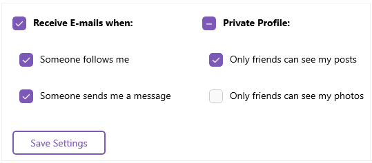

# .NET MAUI CheckBox Overview

**Telerik RadCheckBox for .NET MAUI** is a checkbox control, which enables users to make a choice between two mutually exclusive options. The user selection is indicated by a check mark, and when a user clicks the checkbox, its appearance and state change.  

> The CheckBox follows the rendering guidelines of the operating system. As a result, on iOS its visualized as a circle while `Android` and `WinUI` display it as a square.

## Key Features

* [Checked states]()&mdash;The CheckBox delivers options for setting its state to checked and unchecked, and provides an additional indeterminate state which indicates the control is neither checked nor unchecked.

* [Size]()&mdash;You can set the width and height of the CheckBox by adjusting only a single CheckBox property.

* [Flexible styling API]()&mdash;The CheckBox exposes a set of styling properties for customizing its visual appearance and enables you to set its background, border, and symbol color, as well as customize its layout, including the borders and the check mark.

## Next Steps

- [Getting Started with Telerik UI for .NET MAUI CheckBox]()

## See Also

- [.NET MAUI CheckBox Product Page](https://www.telerik.com/maui-ui/checkbox)
- [.NET MAUI CheckBox Forum Page](https://www.telerik.com/forums/maui?tagId=1784)
- [Telerik .NET MAUI Blogs](https://www.telerik.com/blogs/mobile-net-maui)
- [Telerik .NET MAUI Roadmap](https://www.telerik.com/support/whats-new/maui-ui/roadmap)
