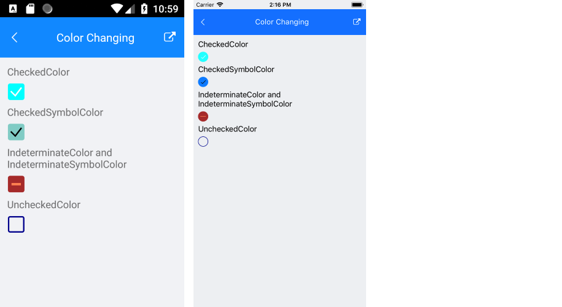

# Styling

The CheckBox provides a set of styling options by exposing properties for customizing its visual appearance.

You can set the color of the check mark as well as the control itself in each of the available states.

## Background, Border, and Symbol Colors

To set the background and border colors of the CheckBox, use the following properties:

* `CheckedColor`&mdash;Defines the Color applied to the control when it is checked. This is both the border and background color.
* `UncheckedColor`&mdash;Defines the Color applied to the control when it is unchecked. This is the border color only, the background is transparent when unchecked.
* `IndeterminateColor`&mdash;Defines the Color applied to the control when it is in Indeterminate state. This is both the border and background color.

To set the symbol colors of the CheckBox, use the following properties:

* `CheckedSymbolColor`&mdash;Defines the Color applied to the check symbol of the control when it is in Checked state.
* `IndeterminateSymbolColor`&mdash;Defines the Color applied to the Indeterminate symbol of the control.

The following example demonstrates how to set the `CheckedColor` property.

 ```XAML
<telerik:RadCheckBox CheckedColor="Aqua" />
 ```

The following example demonstrates how to set the `UncheckedColor` property.

```XAML
<telerik:RadCheckBox UncheckedColor="DarkBlue" />
```

The following example demonstrates how to set the `CheckedSymbolColor` property.

 ```XAML
<telerik:RadCheckBox CheckedSymbolColor="Black" />
 ```

The following example demonstrates how to set the `IndeterminateColor` and `IndeterminateSymbolColor` properties.

```XAML
<telerik:RadCheckBox x:Name="checkbox" IsChecked="{x:Null}" IndeterminateColor="Brown" IndeterminateSymbolColor="Coral" />
```

The image below shows the end result.



## Stroke Thickness

The CheckBox exposes a `StrokeWidth` property that specifies the width of the lines with which the Checkbox element is drawn. It affects the border of the control as well as the check mark.

The following example demonstrates how to apply a `StrokeWidth` value.

```XAMl
<telerik:RadCheckBox x:Name="checkboxStrokeWidth" StrokeWidth="5"/>
```

The image below shows the result at runtime displaying the defined Indeterminate state together with the configured `StrokeWidth` and `Length`.


## See Also

- [Setting the Checkbox Dimensions]()
- [Defining the Checkbox State]()
