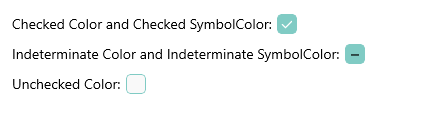

# .NET MAUI CheckBox Styling

The CheckBox provides a set of styling options by exposing properties for customizing its visual appearance.

You can set the color of the check mark as well as the control itself in each of the available states.

## Background, Border, and Symbol Colors

To set the background and border colors of the CheckBox, use the following properties:

* `CheckedColor`&mdash;Defines the Color applied to the control when its checked. This is both the border and background color.
* `UncheckedColor`&mdash;Defines the Color applied to the control when its unchecked. This is the border color only, the background is transparent when unchecked.
* `IndeterminateColor`&mdash;Defines the Color applied to the control when its in Indeterminate state. This is both the border and background color.

To set the symbol colors of the CheckBox, use the following properties:

* `CheckedSymbolColor`&mdash;Defines the Color applied to the check symbol of the control when its in Checked state.
* `IndeterminateSymbolColor`&mdash;Defines the Color applied to the Indeterminate symbol of the control.

The following example demonstrates how to set the `CheckedColor` and `CheckedSymbolColor` properties:

<snippet id='checkbox-checked-color-and-symbolcolor' />

The following example demonstrates how to set the `UncheckedColor` property.

<snippet id='checkbox-uncheckedcolor' />

The following example demonstrates how to set the `IndeterminateColor` and `IndeterminateSymbolColor` properties.

<snippet id='checkbox-inderetminatecolorsymbolcolor' />

The image below shows the end result.

> For a runnable example with the CheckBox Styling scenario, see the [SDKBrowser Demo Application]() and go to **CheckBox > Features** category.

## See Also

- [Defining the Checkbox State]()
