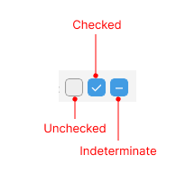

# .NET MAUI CheckBox Visual Structure

The visual structure of the .NET MAUI CheckBox represents the anatomy of the UI component. Being familiar with the visual elements of the CheckBox allows you to quickly find the information required to configure them.

The following image shows the anatomy of the CheckBox.

## Displayed Elements

* **Checked**&mdash;The state of the CheckBox when it is selected.
* **Unchecked**&mdash;The state of the CheckBox when it is not checked.
* **Indeterminate**&mdash;The state of the CheckBox when it is neither checked nor unchecked.

## See Also

* [Getting Started]()
* [CheckBox Styling]()
* [Defining the CheckBox State]()
