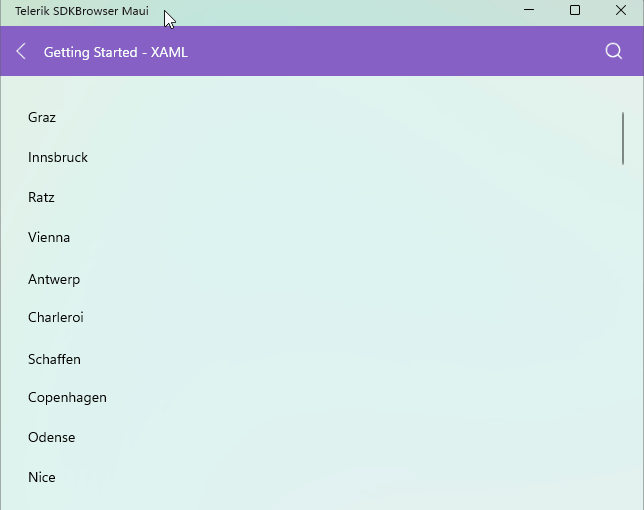

# .NET MAUI CollectionView Keyboard Support on WinUI

The [Telerik UI for .NET MAUI CollectionView]() provides keyboard navigation support on `WinUI`.

@[template](/_contentTemplates/common/collectionview.md#collectionview-keyboard-common-text)

| Hotkey | Action |
| ------ | ------ |
| `Tab` | Enters or exits the CollectionView. |
| `Shift` + `Tab` | Enters or exits the CollectionView. |
| `Up Arrow` | Navigates to the previous item in the CollectionView when the orientation of the `ItemsLayout` is `Vertical`. |
| `Down Arrow` | Navigates to the next item in the CollectionView when the orientation of the `ItemsLayout` is `Vertical`. |
| `Left Arrow` | Navigates to the previous item in the CollectionView when the orientation of the `ItemsLayout` is `Horizontal`. |
| `Right Arrow` | Navigates to the previous item in the CollectionView when the orientation of the `ItemsLayout` is `Horizontal`. |
| `Space` | Selects the currently focused item in `Single` `SelectionMode`. When `SelectionMode` is multiple, the `Space` key selects/deselects the current item. |
| `Page Up` | When all items are in the viewport, the first item becomes current. When not all items are in the viewport, the first rendered item becomes current. Pressing `Page Up` again brings a new portion of items, and the first of them becomes current. |
| `Page down` | When all items are in the viewport, the last item becomes current. When not all items are in the viewport, the last rendered item becomes current. Pressing `Page Down` again brings a new portion of items, and the last of them becomes current. |
| `Home` | The first item in the CollectionView becomes current. |
| `End` | The last item in the CollectionView becomes current. |

@[template](/_contentTemplates/common/collectionview.md#collectionview-keyboard-notes)

Here is how the keyboard navigation support looks on WinUI:

## Additional Resources

- [.NET MAUI CollectionView Product Page](https://www.telerik.com/maui-ui/collectionview)
- [.NET MAUI CollectionView Forum Page](https://www.telerik.com/forums/maui?tagId=1829)
- [Telerik .NET MAUI Blogs](https://www.telerik.com/blogs/mobile-net-maui)
- [Telerik .NET MAUI Roadmap](https://www.telerik.com/support/whats-new/maui-ui/roadmap)

## See Also

- [Keyboard navigation support on MacCatalyst]()
- [Screen Reader]()