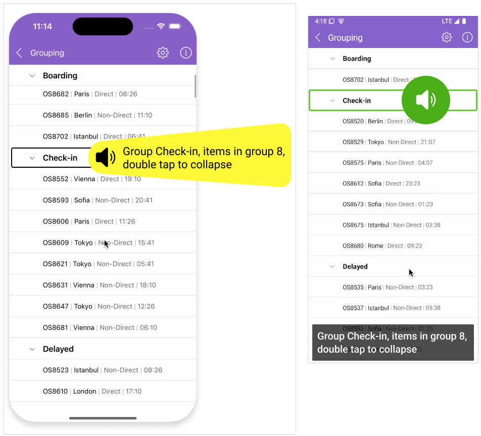

# .NET MAUI CollectionView Screen Reader Support

The Telerik UI for .NET MAUI CollectionView provides extensive accessibility support and enables users with disabilities to acquire complete control over its features.

The CollectionView allows the users to use the Android (TalkBack), WinUI(Narrator), iOS and MacCatalyst (VoiceOver) screen readers for voice descriptions of the elements inside the CollectionView.

## See Also

- [Keyboard navigation support on MacCatalyst]()
- [Keyboard navigation support on WinUI]()