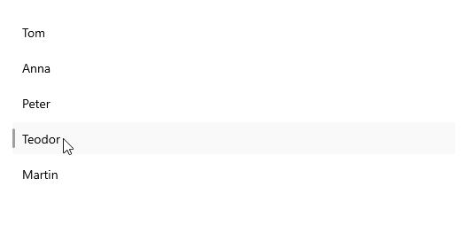
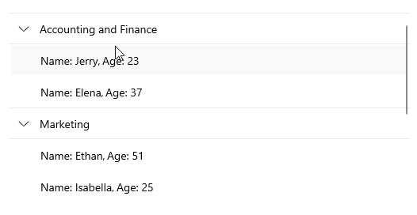

# .NET MAUI CollectionView Commands

The .NET MAUI CollectionView provides various commands that are listed in the following table.

| Commands | Definition |
| -------- | ---------- |
| `ItemTapCommand`(`ICommand`) | Specifies a command to execute when an item is tapped. The command accepts a single parameter with the item being tapped. |
| `GroupTapCommand`(`ICommand`) | Specifies a command to execute when a group item is tapped. The command accepts a single parameter with the group item being tapped. |

>tip Commands action correspond to the events exposed by the CollectionView. For more details, see the [Events]() topic.

### Example with ItemTap Command

**1.** Create a sample model:

<snippet id='collectionview-grouptapcommand-model' />

**2.** Create a `ViewModel` with a command that will be bound to the `RadCollectionView.ItemTapCommand`:

<snippet id='collectionview-itemtap-command-viewmodel' />

**3.** Define the CollectionView control with a sample `ItemTemplate`:

<snippet id='collectionview-item-tapped-command' />

**4.** Add the `telerik` namespace:

```XAML
xmlns:telerik="http://schemas.telerik.com/2022/xaml/maui"
```	

This is the result: 



### Example with GroupTap Command

**1.** Create a sample model:

<snippet id='collectionview-grouptapcommand-model' />

**2.** Create a `ViewModel` with a command that will be bound to the `RadCollectionView.GroupItemTapCommand`:

<snippet id='collectionview-grouptapcommand-viewmodel' />

**3.** Define the CollectionView control with a sample `ItemTemplate`:

<snippet id='commectionview-grouptapcommand' />

**4.** Add the `telerik` namespace:

```XAML
xmlns:telerik="http://schemas.telerik.com/2022/xaml/maui"
```	

This is the result:



> For a runnable example demonstrating the CollectionView Commands, see the [SDKBrowser Demo Application]() and go to **CollectionView > Commands** category.

## See Also

- [Grouping]()
- [Filtering]()
- [Selection]()
- [Events]()
