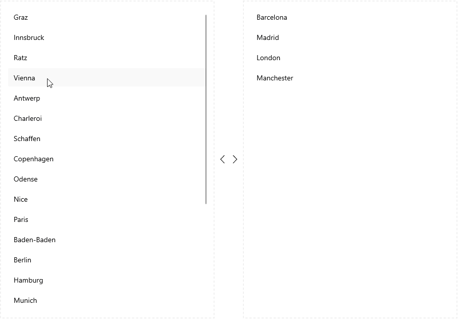

# Drag and Drop between CollectionViews

The app user can directly move items from one CollectionView to another CollectionView through drag-and-drop if the source collection of both instances contains items of the same type.

Check an example on drag and drop between two CollectionViews:

**1.** Add two `RadCollectionView` instances to the page:

<snippet id='collectionview-drag-and-drop' />

**2.** Add a sample `ViewModel` class:

<snippet id='collectionview-draganddrop-viewmodel' />

**3.** Add a sample `DataModel` class:

<snippet id='collectionview-datamodel' />

Here is the result:

## See Also

- [Drag and Drop Overview]()
- [Reorder Grouped Items]()
- [DragVisual and ReorderIndicator Templates]()
- [Reorder Indicator Styling]()
