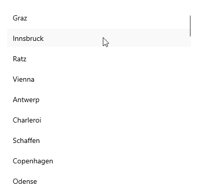

# .NET MAUI CollectionView Drag and Drop

The .NET MAUI CollectionView provides drag and drop functionality which allows the end user to reorder its items. If the feature is enabled, when the user clicks and holds an item, the reorder mode is triggered and the user can move and release the item at the desired position. This also performs a reorder operation on the data. 

To enable the reorder functionality, set the `IsItemsReorderEnabled` property to `True`.

Here is a quick example of a CollectionView with enabled reordering:

**1.** Define the following business object:

<snippet id='collectionview-datamodel' />

**2.** Create a `ViewModel` class as shown below:

<snippet id='collectionview-viewmodel' />

**3.** Add the `RadCollectionView` definition with `IsItemsReorderEnabled` set to `True`:

<snippet id='collectionview-reorder-items' />

## See Also

- [DragVisual and ReorderIndicator Templates]()
- [Reorder Grouped Items]()
- [Drag and Drop between CollectionViews]()