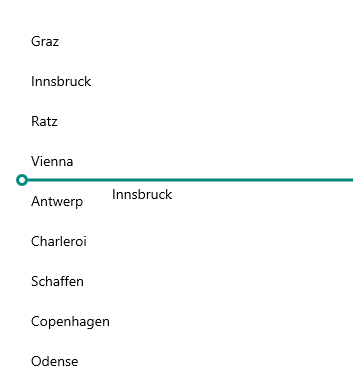

# .NET MAUI CollectionView Reorder Indicator Styling

The Reorder indicator appears while reordering an item inside the CollectionView to notify the end-user where the item can be dropped. To style the Reorder Indicator, create an implicit style and set its `TargetType` to `CollectionViewReorderIndicator`.

Check a quick example with a modified `CollectionViewReorderIndicator`:

**1.** Add the following sample implicit style to the page's resources:

<snippet id='collectionview-reorder-indicator-style' />

**2.** Add the `RadCollectionView` instance to the page:

<snippet id='collectionview-reorder-indicator-styling' />

For the purpose of the example, use the `ViewModel` and `DataModel` classes from the [Drag and Drop Overview]() topic.

Check the result below:

## See Also

- [Drag and Drop Overview]()
- [DragVisual and ReorderIndicator Templates]()
- [Reorder Grouped Items]()
- [Drag and Drop between CollectionViews]()