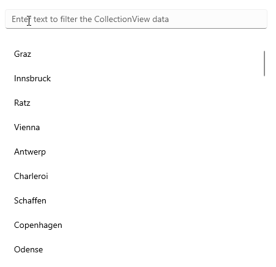

# .NET MAUI CollectionView Filtering

The CollectionView provides the functionality to programmatically filter its data at runtime. 

You can achieve this by adding different filter descriptors in the `RadCollectionView.FilterDescriptors` collection. 

The following descriptor types are supported:

* [Text Filter Descriptor](#text-filter-descriptor)
* [Numerical Filter Descriptor](#numerical-filter-descriptor)
* [DateTime Filter Descriptor](#datetime-filter-descriptor)
* [TimeSpan Filter Descriptor](#timespan-filter-descriptor)
* [Boolean Filter Descriptor](#boolean-filter-descriptor)
* [Nested Property Text Filter Descriptor](#nested-property-text-filter-descriptor)
* [Distinct Values Filter Descriptor](#distinct-values-filter-descriptor)
* [Composite Filter Descriptor](#composite-filter-descriptor)
* [Delegate Filter Descriptor](#delegate-filter-descriptor)

All `FilterDescriptors` are located in the `Telerik.Maui.Controls.Data` namespace.

## Text Filter Descriptor

The `TextFilterDescriptor` represents a descriptor which filters by properties of the `string` data type.

The descriptor supports the following properties:

* `PropertyName`&mdash;Defines the name of the property that is used to retrieve the filter value.
* `Operator`&mdash;Defines the `TextOperator` value that defines how the `Value` member is compared with each value from the items source.
* `Value`&mdash;Defines the value used in the comparisons. This is the right operand of the comparison.
* `IsCaseSensitive`&mdash;Defines a value that determines whether the text comparisons will be case-sensitive. The default value is `true`.

### Example with Text Filter Descriptor

The following example implements a `TextFilterDescriptor` and uses a [`RadEntry`]() control that allows the user to enter a string of text to filter the CollectionView data.

**1.** Define the `RadCollectionView` and `RadEntry` in XAML:

<snippet id='collectionview-text-filter-descriptor'/>

**2.** Add the `telerik` namespace:

```XAML
xmlns:telerik="http://schemas.telerik.com/2022/xaml/maui"
```

**3.** Create a sample `DataModel`:

<snippet id='collectionview-datamodel' />

**4.** Define the `ViewModel` class:

<snippet id='collectionview-viewmodel' />

**5.** Add the `TextFilterDescriptor` to the `RadCollectionView` inside the `RadEntry` `TextChanged` event:

<snippet id='collectionview-filter-function'/>

This is the result:



> For a runnable demo with the CollectionView Filtering example, see the [SDKBrowser Demo Application]() and go to the **CollectionView > Filtering** category.

## Numerical Filter Descriptor

The `NumericalFilterDescriptor` represents a descriptor which filters by properties of the `numerical` data type.

The descriptor exposes the following properties:

* `PropertyName`&mdash;Defines the name of the property that is used to retrieve the filter value.
* `Value`&mdash;Defines the value used in the comparisons. This is the right operand of the comparison.
* `Operator`&mdash;Defines the `NumericalOperator` value that defines the boolean logic behind the left and right operand comparison.

## DateTime Filter Descriptor

The `DateTimeFilterDescriptor` is a descriptor which filters by properties of the `System.DateTime` data type.

The descriptor exposes the following properties:

* `PropertyName`&mdash;Defines the name of the property that is used to retrieve the filter value.
* `Value`&mdash;Defines the value used in the comparisons. This is the right operand of the comparison.
* `Operator`&mdash;Defines the `NumericalOperator` value that defines the boolean logic behind the left and right operand comparison.

## TimeSpan Filter Descriptor

The `TimeSpanFilterDescriptor` is a descriptor which filters by properties of the `System.TimeSpan` data type.

The descriptor exposes the following properties:

* `PropertyName`&mdash;Defines the name of the property that is used to retrieve the filter value.
* `Value`&mdash;Defines the value used in the comparisons. This is the right operand of the comparison.
* `Operator`&mdash;Defines the `NumericalOperator` value that defines the boolean logic behind the left and right operand comparison.

## Boolean Filter Descriptor

The `BooleanFilterDescriptor` is a descriptor which filters by properties of the `System.Boolean` data type.

The descriptor exposes the following properties:

* `PropertyName`&mdash;Gets or sets the name of the property that is used to retrieve the filter value.
* `Value`&mdash;Gets or sets the value used in the comparisons. This is the right operand of the comparison.

## Nested Property Text Filter Descriptor

The `NestedProprtyTextFilterDescriptor` is a descriptor which filters the nested properties.

The descriptor exposes the following properties:

* `PropertyName`&mdash;Defines the name of the property that is used to retrieve the filter value.
* `Operator`&mdash;Defines the `TextOperator` value that defines how the `Value` member is compared with each value from the items source.
* `Value`&mdash;Defines the value used in the comparisons. This is the right operand of the comparison.
* `IsCaseSensitive`&mdash;Defines a value that determines whether the text comparisons will be case-sensitive. The default value is `true`.

## Distinct Values Filter Descriptor

The `DistinctValuesFilterDescriptor` is a descriptor which filters by distinct values.

The descriptor exposes the following properties:

* `PropertyName`&mdash;Defines the name of the property that is used to retrieve the filter value.
* `Value`&mdash;Defines the value used in the comparisons. This is the right operand of the comparison.

## Composite Filter Descriptor

The `CompositeFilterDescriptor` represents a special `FilterDescriptorBase` that stores an arbitrary number of other descriptors instances. The logical `AND` or `OR` operator is applied upon all composed filters to determine the result of the `PassesFilter` routine.

## Delegate Filter Descriptor

The `DelegateFilterDescriptor` exposes the `Filter` property, which gets or sets the `IFilter` implementation used to check whether a data item passes the filter or not.

To use a `DelegateFilterDescriptor`, you need to create a class that implements the `IFilter` interface which will return the `Key` by which you want to filter. Then, you need to add a `DelegateFilterDescriptor` to the `RadCollectionView.FilterDescriptors` collection and set its `Filter` property.

## See Also

- [Grouping]()
- [Sorting]()
- [Selection]()
- [Commands]()