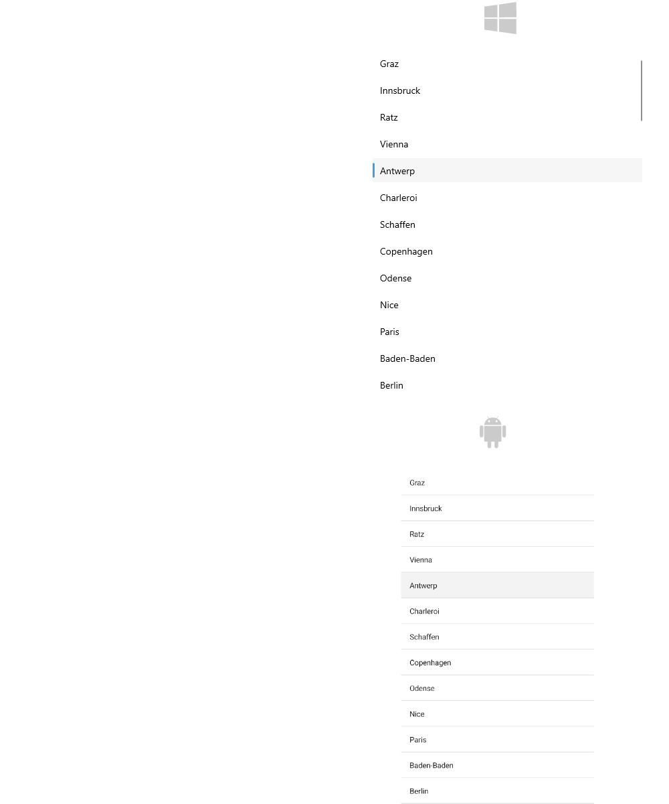

# Getting Started with the .NET MAUI CollectionView

This guide provides the information you need to start using the Telerik UI for .NET MAUI CollectionView by adding the control to your project.

At the end, you will achieve the following result.



## Prerequisites

Before adding the CollectionView, you need to:

1. [Set up your .NET MAUI application](#step-1-set-up-your-net-maui-application).

1. [Download Telerik UI for .NET MAUI](#step-2-download-telerik-ui-for-net-maui).

1. [Install Telerik UI for .NET MAUI](#step-3-install-telerik-ui-for-net-maui).

1. [Register the required handlers](#step-4-register-required-handlers).

## Define the Control

**1.** When your .NET MAUI application is set up, you are ready to add a CollectionView control to your page. The following example shows a sample CollectionView definition populated with sample data:

**2.** Define the `RadCollectionView` in XAML:

<snippet id='collectionview-gettingstarted-xaml'/>
<snippet id='collectionview-getting-started-csharp'/>

> The CollectionView provides UI virtualization, which requires the visual parent to provide vertical or horizontal space. To prevent breaking the UI virtualization or gesture mechanisms:
>* Do not place the CollectionView inside a `ScrollView`.
>* Do not set the CollectionView to a `RowDefinition Height="Auto"` Grid definition.

**3.** Add the `telerik` namespace:

```XAML
xmlns:telerik="http://schemas.telerik.com/2022/xaml/maui"
```

**4.** Create sample `DataModel`:

<snippet id='collectionview-datamodel' />

**5.** Define the `ViewModel` class:

<snippet id='collectionview-viewmodel' />

**5.** Register the Telerik controls through the `Telerik.Maui.Controls.Compatibility.UseTelerik` extension method called inside the `CreateMauiApp` method of the `MauiProgram.cs` file of your project:

```C#
using Telerik.Maui.Controls.Compatibility;

public static class MauiProgram
{
	public static MauiApp CreateMauiApp()
	{
		var builder = MauiApp.CreateBuilder();
		builder
			.UseTelerik()
			.UseMauiApp<App>()
			.ConfigureFonts(fonts =>
			{
				fonts.AddFont("OpenSans-Regular.ttf", "OpenSansRegular");
			});

		return builder.Build();
	}
}           
```

> For a runnable demo with the CollectionView Getting Started example, see the [SDKBrowser Demo Application]() and go to the **CollectionView > Getting Started** category.

## Additional Resources

- [Item Appearance]()
- [Grouping]()
- [Filtering]()
- [Sorting]()
- [Selection]()
- [Commands]()
- [Events]()

## See Also

- [.NET MAUI CollectionView Product Page](https://www.telerik.com/maui-ui/listview)
- [.NET MAUI CollectionView Forum Page](https://www.telerik.com/forums/maui?tagId=1829)
- [Telerik .NET MAUI Blogs](https://www.telerik.com/blogs/mobile-net-maui)
- [Telerik .NET MAUI Roadmap](https://www.telerik.com/support/whats-new/maui-ui/roadmap)