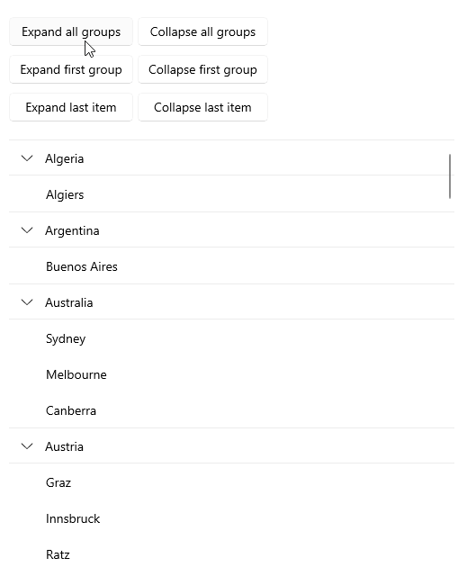

# .NET MAUI CollectionView Expand and Collapse Groups

The CollectionView supports group expand and collapse operations either through the UI by tapping on the group headers, or programmatically. By default, all the groups are expanded. In addition, the user can expand or collapse an item from a group. 

This section provides an overview of the methods used to control the expand/collapse state of the CollectionView groups.

## Get the Grouped CollectionView Items

To manipulate the collapsible CollectionView groups, first you will need to call its `GetDataView()` method. In short, the `GetDataView()` method provides a view of the `ItemsSource` after all the sorting, grouping, and filtering operations are applied. The return type is `IDataViewCollection` which exposes the `Expand` and `Collapse` methods.

```C#
var dataView = this.collectionView.GetDataView();
```

## Expand and Collapse All Groups

To expand all groups, use the `ExpandAll()` method and, to collapse all groups&mdash;`CollapseAll()` method.



The following example demonstrates how these methods are used:

* Expanding all groups:

<snippet id='collectionview-expandall' />

* Collapsing all groups:

<snippet id='collectionview-collapseall' />

## Expand and Collapse Specific Group

You can retrieve the first-level groups through the `GetGroups()` method of the `IDataViewCollection` object and use `ExpandGroup()`/`CollapseGroup()` to make a certain group to expand or collapse respectively. You can check whether a group is expanded trough the `GetIsExpanded()` method.


The following example demonstrates how these methods are used:

* Expanding a specific group:

<snippet id='collectionview-expandgroup' />

* Collapsing a specific group:

<snippet id='collectionview-collapsegroup' />

## Expand and Collapse Specific Item from a Group

You can expand or collapse a specific item from a group by using the `ExpandItem()`/`CollapseItem()` methods.

The following example demonstrates how these methods are used:

* Expanding a specific item from a group:

<snippet id='collectionview-expanditem' />

* Collapsing a specific item from a group:

<snippet id='collectionview-collapseitem' />

> For a runnable demo with the CollectionView Expand Collapse Group scenario, see the [SDKBrowser Demo Application]() and go to the **CollectionView > Grouping** category.

## See Also

- [Property Group Descriptor]()
- [Delegate Group Descriptor]()
- [Multi-level Grouping Descriptor]()
- [Group Header]()
