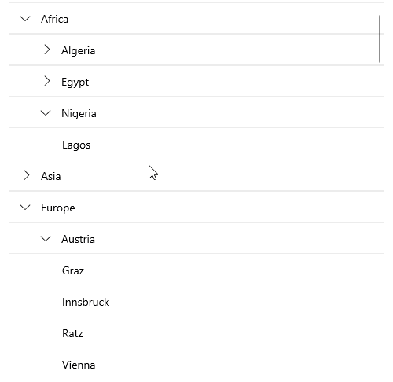

# .NET MAUI CollectionView Grouping

The .NET MAUI CollectionView provides you with the functionality to programmatically group its data at runtime. You can programmatically group the data by adding group descriptors to the  `RadCollectionView.GroupDescriptors` collection. To achieve this, use the following descriptors:

* [`PropertyGroupDescriptor`]()&mdash;Uses a property from the model as a group key.
* [`DelegateGroupDescriptor`]()&mdash;Enables you to group by a custom key (for example, some complex expression combining two or more properties) instead of being limited by the value of a single property. 

## Group Header

When a group descriptor is applied, the default group template is visualized. Review the [Group Header]() article to learn more about how to style and customize the group header.

## Expand and Collapse Groups

The control supports groups expand and collapse operations through the UI by tapping on the group headers.

By default, all groups are auto-expanded when the CollectionView initially loads. You can load the CollectionView with all groups collapsed by setting the `AutoExpandGroups` (`bool`) property to `false`. The default value of the `AutoExpandGroups` property is `true`.

## Bindable GroupDescriptor

Users can control the `GroupDescriptors` collection by using MVVM.

## Sticky Group Headers

The CollectionView provides the option to set its [group headers as sticky](). This means the `GroupHeader` UI element "freezes" while scrolling through the items until the whole group is scrolled away. As you scroll through the next group, the currently stuck group header will be pushed by the next group header.
In a multi-level grouping scenario, the last inner group from the parent group will be sticky.

## Styling the Group Header 

Style the group header by setting the following properties:

* `GroupContainerStyle` (`Style` with target type `RadCollectionViewGroupView`)&mdash;Specifies the style applied to the group header when grouping is applied.

## See Also

- [Property Group Descriptor]()
- [Delegate Group Descriptor]()
- [Multi-level Grouping Descriptor]()
- [Group Header]()
