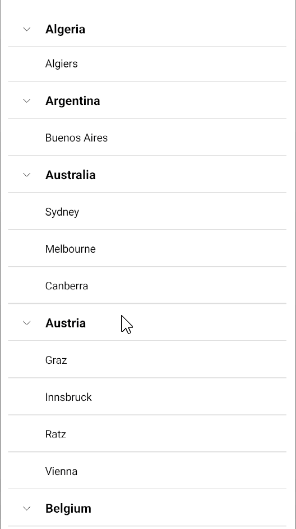
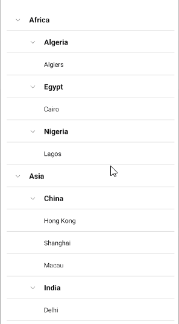

# .NET MAUI CollectionView Sticky Group Headers (Android and iOS)

The CollectionView for .NET MAUI provides the option to set its group headers as sticky (only on Android and iOS). This means the `GroupHeader` UI element "freezes" while scrolling through the items until the whole group is scrolled away. As you scroll through the next group, the currently stuck group header will be pushed by the next group header.

In a multi-level grouping scenario, the last inner group from the parent group will be sticky.

To enable the sticky group headers behavior, set `EnableStickyGroupHeaders` (`bool`) property of the CollectionView to `True`. By default, the `EnableStickyGroupHeaders` value is `False`.

```XAML
<telerik:RadCollectionView EnableStickyGroupHeaders="True"  />
```
```C#
var collectionView = new RadCollectionView();
collectionView.EnableStickyGroupHeaders = true;
```

Here is how the sticky group headers look in a single-level grouping scenario:



Here is how the sticky group headers look in multi-level grouping scenario:



## See Also

- [Property Group Descriptor]()
- [Delegate Group Descriptor]()
- [Multi-level Grouping Descriptor]()
- [Group Header]()
