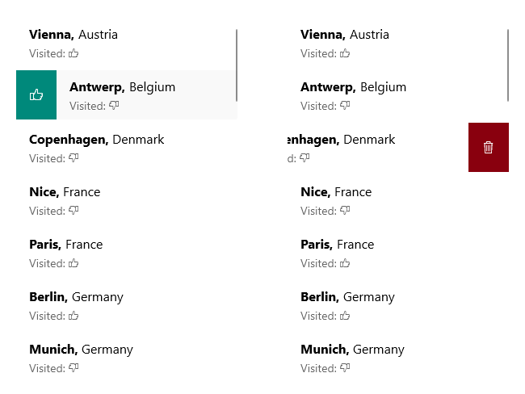

# .NET MAUI CollectionView Item Swipe

.NET MAUI CollectionView provides item swipe feature - when users swipe, they reveal a designated custom view with buttons, images etc.

The image below shows how swiping can reveal buttons on the left and right:

## Properties

You can use the following `RadCollectionView` properties to configure the Item Swipe feature:

- `IsItemSwipeEnabled`(`bool`)&mdash;Indicates whether the items of the CollectionView can be swiped. The default value is `False`.
- `SwipeThreshold`(`double`)&mdash;Defines the length (in pixels) of the swipe gesture that is required to trigger the feature.
- `SwipeOffset`(`Thickness`)&mdash;Defines the distance that a swiped item will be moved to and stay there until the swipe gets closed.
- `StartSwipeTemplate`(`DataTemplate`)&mdash;Defines the content that is visualized when swipe is performed to left in vertical orientation or up in horizontal orientation.
- `EndSwipeTemplate`(`DataTemplate`)&mdash;Defines the content that is visualized when swipe is performed to right in vertical orientation or down in horizontal orientation.

## Methods

The following `RadCollectionView` methods are related to the cell swiping feature:

- void `EndItemSwipe`(`bool` `isAnimated`)&mdash;Moves the swiped item to its default position.

Check below an example of the `CollectionView` with `StartSwipeTemplate` and `EndSwipeTemplate` defined. Through the `StartSwipeTemplate` users can update a property of the data item, and through the `EndSwipeTemplate` users can delete an item.

**1.** Add sample `StartSwipeTemplate` and `EndSwipeTemplate` DataTemplates to the page's resources:

<snippet id='collectionview-itemswipe-templates' />

**2.** Add the `CollectionView` definition with `IsItemSwipeEnabled` applied:

<snippet id='collectionview-item-swipe' />

**3.** Add the events defined in the DataTemplates:

<snippet id='collectionview-itemswipe-code' />

**4.** Add the `ViewModel` class:

<snippet id='collectionview-itemswipe-viewmodel' />

**5.** Add the business object class:

<snippet id='collectionview-itemswipe-datamodel' />

## See Also

- [Swipe Events]()
- [Swipe Commands]()
