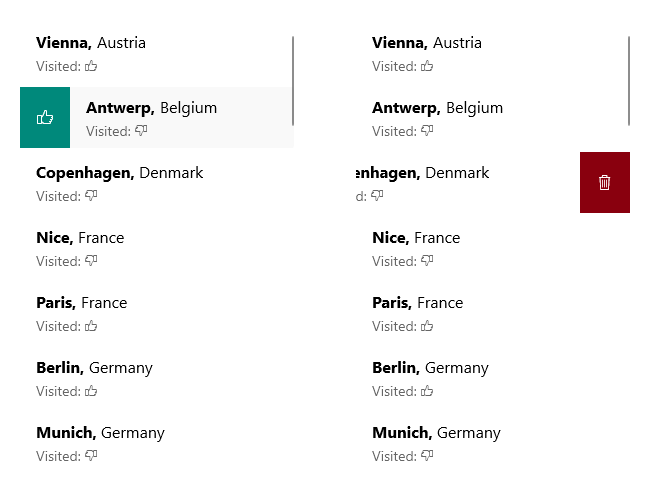

# .NET MAUI CollectionView Item Swipe

Use the .NET MAUI CollectionView item swipe feature to reveal custom content when the user swipes an item. You can show action buttons, icons, or other views and use them for common scenarios such as update, archive, or delete operations.

This article explains how item swipe works, which properties control the behavior, and how to build a complete example with start and end swipe templates.

The following image shows swipe actions revealed on both sides of a CollectionView item:

## How Does CollectionView Item Swipe Work

When item swipe is enabled, the user swipes a CollectionView item to expose a template that contains custom content. The swipe direction depends on the CollectionView orientation:

- In a vertically oriented CollectionView, `StartSwipeTemplate` appears on swipe left and `EndSwipeTemplate` appears on swipe right.
- In a horizontally oriented CollectionView, `StartSwipeTemplate` appears on swipe up and `EndSwipeTemplate` appears on swipe down.

Use this feature when you want quick item-level actions without opening a separate details screen or context menu.

## Properties

Use the following `RadCollectionView` properties to configure item swipe:

- `IsItemSwipeEnabled`(`bool`)&mdash;Indicates whether the items of the CollectionView can be swiped. The default value is `False`.
- `SwipeThreshold`(`double`)&mdash;Defines the length (in pixels) of the swipe gesture that is required to trigger the feature.
- `StartSwipeLength`(`double`)&mdash;Defines how far the item moves and remains open when the start swipe template is revealed.
- `EndSwipeLength`(`double`)&mdash;Defines how far the item moves and remains open when the end swipe template is revealed.
- `StartSwipeTemplate`(`DataTemplate`)&mdash;Defines the content shown for a swipe left in vertical orientation or a swipe up in horizontal orientation.
- `EndSwipeTemplate`(`DataTemplate`)&mdash;Defines the content shown for a swipe right in vertical orientation or a swipe down in horizontal orientation.

If you want different actions on each side, define both swipe templates and set lengths that match the size of the content inside each template.

## Methods

Use the following `RadCollectionView` method when you want to return the swiped item to its default position after the user taps an action:

- void `EndItemSwipe`(`bool` `isAnimated`)&mdash;Moves the swiped item to its default position.

Call `EndItemSwipe` after the action completes when you want to close the swipe programmatically.

## How Do You Create a CollectionView with Swipe Actions

The following example defines both `StartSwipeTemplate` and `EndSwipeTemplate`. In this sample, the start swipe template updates a property of the data item, while the end swipe template deletes the item.

1. Add `StartSwipeTemplate` and `EndSwipeTemplate` data templates to the page resources:

<snippet id='collectionview-itemswipe-templates' />

2. Add the `CollectionView` definition and set `IsItemSwipeEnabled`:

<snippet id='collectionview-item-swipe' />

3. Add the event handlers referenced by the swipe templates:

<snippet id='collectionview-itemswipe-code' />

4. Add the `ViewModel` class that exposes the item collection:

<snippet id='collectionview-itemswipe-viewmodel' />

5. Add the business object class used by the CollectionView items:

<snippet id='collectionview-itemswipe-datamodel' />

## See Also

- [Swipe Events]()
- [Swipe Commands]()
