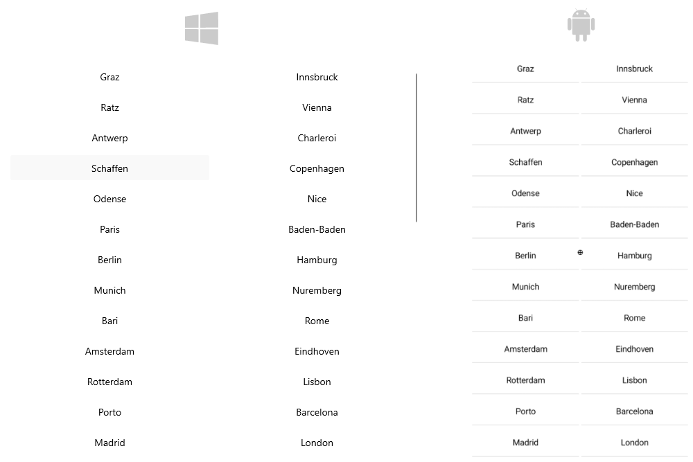
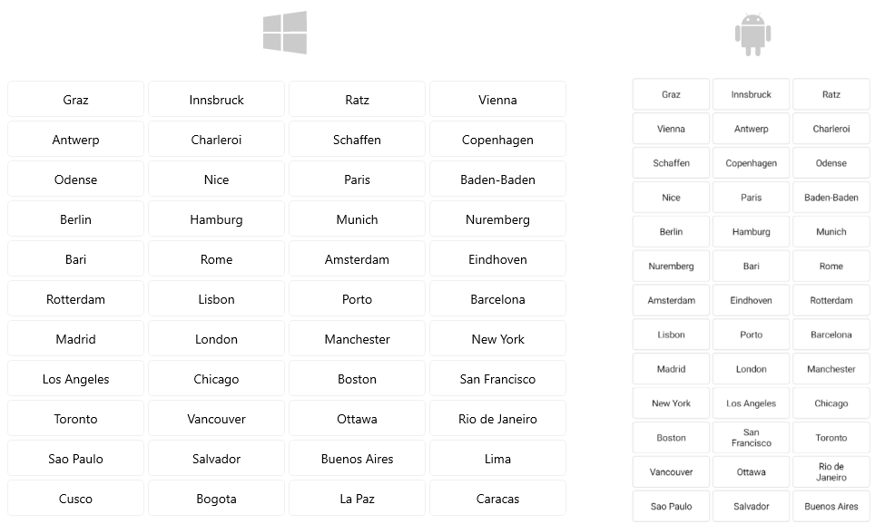

# .NET MAUI CollectionView Grid Layout

The CollectionView control supports grid layout through its `ItemsLayout` property. The `ItemsLayout` accepts values of type `CollectionViewLayoutBase` which is a base class.


The grid layout allows distributing cells in a fixed number of columns/rows. The grid layout can be set by creating an instance of the `CollectionViewGridLayout` class and assigning it to the `RadCollectionView.ItemsLayout` property.

Sample `RadCollectionView` definition with `CollectionViewGridLayout`:

```XAML
<telerik:RadCollectionView>
    <telerik:RadCollectionView.ItemsLayout>
        <telerik:CollectionViewGridLayout />
    </telerik:RadCollectionView.ItemsLayout>
</telerik:RadCollectionView>
```

This is how the items are arranged when grid layout is defined:



The properties available in the `CollectionViewGridLayout` are: 

* `SpanCount` (`int`)&mdash;Specifies the count of the columns or rows (depending on the orientation) of the layout.The value must be `>= 1`. The default value is `2`.
* `HorizontalItemSpacing` (`double`)&mdash;Specifies the horizontal empty space around each item. The default value is `0.0`.
* `VerticalItemSpacing` (`double`)&mdash;Specifies the vertical empty space around each item.The default value is `0.0`.
* `Orientation` (enum or type `Telerik.Maui.Orientation`)&mdash;Specifies the orientation of the layout. The available options are: `Horizontal` and (default) `Vertical`.

## Example with Grid Layout

The following example demonstrates how to apply grid layout to the `RadCollectionView`.
 
**1.** Define the following business object:

<snippet id='collectionview-datamodel' />

**2.** Create a `ViewModel` class as shown below:

<snippet id='collectionview-viewmodel' />

**3.** Add the `RadCollectionView` definition with grid layout:

<snippet id='collectionview-grid-layout' />

**4.** Include the `telerik` namespace:

```XAML
xmlns:telerik="http://schemas.telerik.com/2022/xaml/maui" 
```

This is the result:



> For a runnable demo with the CollectionView `CollectionViewGridLayout`, see the [SDKBrowser Demo Application]() and go to the **CollectionView > Layouts** category.

## See Also

- [Grouping]()
- [Sorting]()
- [Selection]()
- [Commands]()