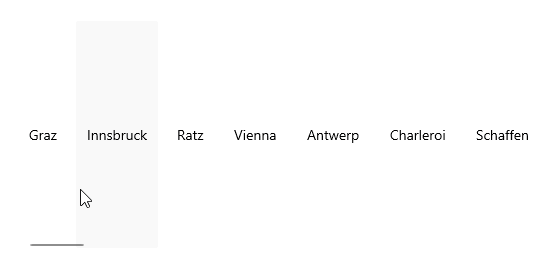

# .NET MAUI CollectionView Linear Layout

The CollectionView control supports linear layouts through its `ItemsLayout` property. The `ItemsLayout` accepts values of type `CollectionViewLayoutBase` which is a base class.

The linear layout is the default layout of the control. The linear layout can be explicitly set by creating an instance of the `CollectionViewLinearLayout` class and assigning it to the `RadCollectionView.ItemsLayout` property.

```XAML
<telerik:RadCollectionView>
    <telerik:RadCollectionView.ItemsLayout>
        <telerik:CollectionViewLinearLayout />
    </telerik:RadCollectionView.ItemsLayout>
</telerik:RadCollectionView>
```

The properties available in the `CollectionViewLinearLayout` are: 

* `ItemSpacing` (`double`)&mdash;Specifies the spacing between the items. The default value is `0`.
* `ItemLength` (`double`)&mdash;Specifies the width or height (depending on the layout orientation) of the items. The default value is `-1`, which means that the items will be sized according to the targeted platform default behavior.
* `Orientation` (enum or type `Telerik.Maui.Orientation`)&mdash;Specifies the orientation of the layout.The available options are: `Horizontal` and `Vertical` (default).

## Example with Horizontal Layout Orientation

The following example demonstrates how to apply horizontal orientation to the `RadCollectionView`.
 
**1.** Define the following business object:

<snippet id='collectionview-datamodel' />

**2.** Create a `ViewModel` class as shown below:

<snippet id='collectionview-viewmodel' />

**3.** Add the `RadCollectionView` definition with linear layout:

<snippet id='collectionview-linear-layout' />

**4.** Include the `telerik` namespace:

```XAML
xmlns:telerik="http://schemas.telerik.com/2022/xaml/maui" 
```

This is the result:



> For a runnable demo with the CollectionView `CollectionViewLinearLayout`, see the [SDKBrowser Demo Application]() and go to the **CollectionView > Layouts** category.

## See Also

- [Grouping]()
- [Sorting]()
- [Selection]()
- [Commands]()